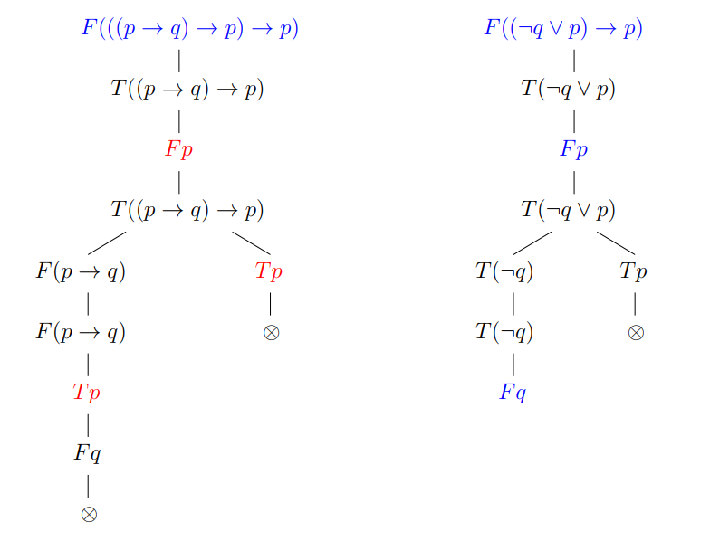

# Společná matematika

## 1. Základy diferenciálního a integrálního počtu

### Posloupnosti reálných čísel a jejich limity

#### Definice, aritmetika limit

Nechť $M$ je množina. Posloupnost s hodnotami v $M$ je zobrazení z $\mathbb{N}$ do $M$. Každé přirozené číslo $n$ je tedy zobrazeno na nějaký prvek $a_n$ množiny $M$, tomu říkáme $n$-tý prvek posloupnosti. Posloupnost $(a_1, a_2, a_3, ...)$ značíme $(a_n)$ nebo $(a_n)^\infty_{n=1}$. $(a_n) \subset M$ značí posloupnost s hodnotami v $M$.

Posloupnost může být:
- shora omezená pokud $\exists K \in \mathbb{R}$ takové, že $\forall n \in \mathbb{N}: a_n < K$,
- zdola omezená pokud $\exists K \in \mathbb{R}$ takové, že $\forall n \in \mathbb{N}: a_n > K$,
- omezená pokud je shora i zdola omezená,
- rostoucí pokud $a_n < a_m$ pro každé $n < m$,
- neklesající pokud $a_n \leq a_m$ pro každé $n < m$,
- klesající pokud $a_n > a_m$ pro každé $n < m$,
- nerostoucí pokud $a_n \geq a_m$ pro každé $n < m$,
- monotónní pokud je neklesající nebo nerostoucí.

Vlastní limita: Nechť $(a_n)$ je posloupnost reálných čísel. $A \in \mathbb{R}$ je vlastní limita takové posloupnosti, pokud pro každé reálné $\epsilon > 0$ existuje $n_0 \in \mathbb{N}$ takové, že pro každé $n \geq n_0$ je $|a_n - A| < \epsilon$. Pokud posloupnost má vlastní limitu, pak konverguje a píšeme $\lim_{n \rightarrow \infty} a_n = A$.

Nevlastní limita: Nechť $(a_n)$ je posloupnost reálných čísel. Posloupnost má nevlastní limitu $\infty, \lim_{n \rightarrow \infty} a_n = \infty$, pokud pro každé reálné číslo $K$ existuje $n_0$ takové, že pro každé $n \geq n_0$ platí $a_n > K$. Obdobně pro $-\infty$, stačí otočit poslední nerovnost.

Každá posloupnost reálných čísel má nejvýše jednu limitu (vlastní či nevlastní).

Je-li posloupnost reálných čísel neklesající a shora omezená, pak konverguje.

Posloupnost $(b_n)$ je podposloupností posloupnosti $(a_n)$, pokud existuje $f: \mathbb{N} \rightarrow \mathbb{N}, b_n = a_{f(n)}$. Je zřejmé, že relace "být podposloupností" je tranzitivní a reflexivní, ale ne antisymetrická.

Je-li $(b_n)$ podposloupnost $(a_n)$ a $\lim_{n \rightarrow \infty} a_n = a \in \mathbb{R}^*$, pak i $\lim_{n \rightarrow \infty} b_n = a$.

Aritmetika limit: Nechť $(a_n), (b_n)$ jsou posloupnosti reálných čísel s $\lim_{n \rightarrow \infty} a_n = a \in \mathbb{R}^*, \lim_{n \rightarrow \infty} b_n = b \in \mathbb{R}^*$. Pak platí:
1. $\lim_{n \rightarrow \infty} (a_n + b_n) = a + b$
2. $\lim_{n \rightarrow \infty} (a_n b_n) = ab$
3. pokud $b_n \not = 0$ pro každé $n > n_0$, pak $\lim_{n \rightarrow \infty} (a_n / b_n) = a/b$

Všechny uvedené věty platí, pokud výraz na pravé straně je definován.

#### Věta o dvou policajtech, limity a uspořádání

Nejprve o uspořádání: Nechť posloupnosti $(a_n), (b_n) \subset \mathbb{R}$ mají vlastní limity $\lim_{n \rightarrow \infty} a_n = a, \lim_{n \rightarrow \infty} b_n = b$.
1. Když $a < b$, tak existuje $n_0$, že $n > n_0 \implies a_n < b_n$.
2. Když $a_n \leq b_n$ pro každé $n > n_0$, pak $a \leq b$.

Toto platí i pro nevlastní limity, ovšem je třeba dát si pozor na rovnost.

O dvou policajtech: Nechť posloupnosti $(a_n), (b_n), (c_n) \subset \mathbb{R}$ splňují $\lim_{n \rightarrow \infty} a_n = \lim_{n \rightarrow \infty} b_n = a \in \mathbb{R}$ a pro každé $n > n_0$ platí $a_n \leq c_n \leq b_n$. Pak $(c_n)$ konverguje a $\lim_{n \rightarrow \infty} c_n = a$.

### Řady

Nekonečná řada je výraz $\sum^\infty_{n=1}a_n = a_1 + a_2 + ...$, kde $(a_n)$ je posloupnost reálných čísel.

#### Definice částečného součtu a součtu

Částečný součet řady $s_n$ je součet prvních $n$ členů. Pokud existuje vlastní limita posloupnosti $(s_n)$ částečných součtů řady, pak mluvíme o konvergentní řadě a $\lim_{n \rightarrow \infty} (s_n)$ je jejím součtem. Pokud limita neexistuje nebo je nevlastní, jde o divergentní řadu.

#### Geometrická řada, harmonická řada

Geometrická řada: $\sum_{n=0}^\infty q^n = 1 + q + q^2 + ...$, kde $q \in \mathbb{R}$ značíme kvocient. Pro součet geom. řady platí, že
1. pro $-1 < q < 1$ je součet $\frac{1}{1-q}$
2. pro $q \geq 1$ je součet $+\infty$
3. pro $q \leq -1$ součet neexistuje.

Dalším příkladem jsou řady typu $\sum_{n=1}^\infty \frac{1}{n^s} = 1 + \frac{1}{2^s} + ...$, pro $s = 1$ mluvíme o harmonické řadě. Ačkoliv prvky řady jdou k nule, tak řada diverguje.

### Reálné funkce jedné reálné proměnné

Funkce $f: M \rightarrow \mathbb{R}, M \subseteq \mathbb{R}$ je

- shora omezená pokud $\exists K \in \mathbb{R}$ takové, že $f(x) < K$ pro každé $x \in M$,
- zdola omezená pokud $\exists K \in \mathbb{R}$ takové, že $f(x) < K$ pro každé $x \in M$,
- omezená pokud je shora i zdola omezená,
- rostoucí pokud $f(x) < f(y)$ pro každé $x, y \in M, x < y$,
- neklesající pokud $f(x) \leq f(y)$ pro každé $x, y \in M, x < y$,
- klesající pokud $f(x) > f(y)$ pro každé $x, y \in M, x < y$,
- nerostoucí pokud $f(x) \geq f(y)$ pro každé $x, y \in M, x < y$,
- monotónní pokud je neklesající nebo nerostoucí,
- periodická funkce s periodou $p \in \mathbb{R}, p > 0$, když pro každé $x \in M$ je i $x \pm p \in M, f(x) = f(x \pm p)$,
- prostá pokud $x \not = y \implies f(x) \not = f(y)$.

Nechť $f: M \rightarrow \mathbb{R}$ je prostá funkce. $f^{-1}$ je inverzní funkce k $f$, pokud $f^{-1}(y) = x \iff f(x) = y$.

Funkce mohou být definovány řadou - třeba exponenciála, sinus, cosinus.

Okolí bodu $a \in \mathbb{R}$, respektive $\delta$-okolí pro $\delta > 0, \delta \in \mathbb{R}$ je inverval $U(a, \delta) = (a - \delta, a + \delta)$. Jinak zapsáno $U(a, \delta) = \{ x \in \mathbb{R}: |x - a| < \delta \}$. Okolí nekonečen definujeme $U(+\infty, \delta) = (1/\delta, +\infty), U(-\infty, \delta) = (-\infty, -1/\delta)$. Pravé okolí defingujeme jako $U^+(a, \delta) = [a, a + \delta)$, levé okolí obdobně. Prstencová okolí bodu jsou stejná, akorát neobsahují bod $a$.

#### Limita funkce v bodě

##### Definice, aritmetika limit

Řekněme, že funkce $f$ má v bodě $a \in \mathbb{R}^*$ limitu $A \in \mathbb{R}^*$, když $\forall \epsilon > 0 \exists \delta > 0: x \in P(a, \delta) \implies f(x) \in U(A, \epsilon)$. Zapisujeme $\lim_{x \rightarrow a} f(x) = A$. Jednostranné limity definujeme obdobně, pro limitu zprava značíme $\lim_{x \rightarrow a^+} f(x) = A$ a místo prstencového okolí z definice uvažujeme prstencové pravé okolí, opět obdobně pro limitu zleva.

Jestliže se rovnají limita pro jeden bod zleva i zprava, pak se takovému číslu rovná i limita v daném bodě. Naopak, pokud se limity liší, pak limita neexistuje. Funkce má v daném bodě nejvýše jednu limitu.

Heineho definice limity funkce: Nechť $f$ je definovaná na prstencovém okolí $P(a, \delta)$ bodu $a$ pro $\delta > 0$. Pak jsou následující tvrzení ekvivalentní:
1. $\lim_{x \rightarrow a} f(x) = A$,
2. pro každou posloupnost $(x_n) \subset P(a, \delta)$ takovou, že $x_n \not = a$ pro každé $n \in \mathbb{N}, \lim_{n \rightarrow \infty} x_n = a$ platí, že $\lim_{n \rightarrow \infty} f(x_n) = A$.

Aritmetika limit: Nechť $a, A, B \in \mathbb{R}^*$ a $f, g$ funkce definované na prstencovém okolí $P(a, \delta)$ bodu $a$ a platí $\lim_{x \rightarrow a} f(x) = A, \lim_{x \rightarrow a} g(x) = B$. Pak platí:
1. $\lim_{x \rightarrow a} f(x) + g(x) = A + B$,
2. $\lim_{x \rightarrow a} f(x) g(x) = AB$,
3. pro $g(x)$ nenulovou na prstencovém okolí $a$ platí $\lim_{x \rightarrow a} f(x)/g(x) = A/B$.

Uvedené věty platí ve chvíli, kdy jsou pravé strany definované.

##### Vztah s uspořádáním

Nechť $c \in \mathbb{R}^*$ a funkce $f, g, h$ jsou definované na prstencovém okolí bodu $c$. Pak:
1. Mají-li $f, g$ v bodě $c$ limitu a $\lim_{x \rightarrow c} f(x) > \lim_{x \rightarrow c} g(x)$, pak existuje $\delta > 0$ takové, že $f(x) > g(x)$ pro každé $x \in P(c, \delta)$.
2. Existuje-li $\delta > 0$ takové, že $f(x) \geq g(x)$ pro každé $x \in P(c, \delta)$ a mají-li funkce $f, g$ limitu v bodě $c$, potom $\lim_{x \rightarrow c} f(x) \geq \lim_{x \rightarrow c} g(x)$.
3. Existuje-li $\delta > 0$ takové, že $f(x) \leq h(x) \leq g(x)$ pro každé $x \in P(c, \delta)$ a $\lim_{x \rightarrow c} f(x) = \lim_{x \rightarrow c} g(x) = A \in \mathbb{R}^*$, potom i $\lim{x \rightarrow c} h(x) = A$.

##### Limita složené funkce

Nechť $A, B, C \in \mathbb{R}^*$, nechť $g(x)$ je funkce splňující $\lim_{x \rightarrow A} g(x) = B$ a $f(x)$ je funkce splňující $\lim_{x \rightarrow B} f(x) = C$ a je splněna jedna z podmínek:
1. $f(x)$ je spojitá v $B$, tedy $f(B) = \lim_{x \rightarrow B} f(x) = C$
2. Na nějakem prstencovém okolí $P(A, \mu)$ funkce $g(x)$ nenabývá hodnotu $B$, tedy $B \not \in g(P(A, \mu))$.

Potom $\lim_{x \rightarrow A} f(g(x)) = C$.

#### Funkce spojité na intervalu

Funkce $f$ je spojitá v bodě $b \in \mathbb{R}$, pokud platí $\lim_{x \rightarrow b} f(x) = f(b)$.

Nechť $I \subseteq \mathbb{R}$ je interval a $f: I \rightarrow \mathbb{R}$ je funkce na něm definovaná. Pak je $f$ na intervalu $I$ spojitá, je-li spojitá v každém vnitřním bodu $I$ a na krajích $I$ je odpovídajícím způsobem jednostranně spojitá.

##### Věta o nabývání mezihodnot (Darbouxova)

Nechť $a < b$ jsou reálná čísla a funkce $f: [a, b] \rightarrow \mathbb{R}$ je na intervalu $[a, b]$ spojitá. Označme $m = min\{f(a), f(b)\}, M = max\{f(a), f(b)\}$. Pak každé reálné číslo z intervalu $[m, M]$ je hodnotou funkce $f$, tedy $\forall y \in [m, M] \exists \alpha \in [a, b]: f(\alpha) = y$.

##### Věta o nabývání maxima

Nejprve si maximum funkce a další extrémy definujme.

Nechť $M \subseteq \mathbb{R}, f: M \rightarrow \mathbb{R}$. Řekněme, že funkce $f$ v bodě $a \in M$ nabývá svého:
- minima, když $\forall x \in M: f(x) \geq f(a)$
- maxima, když $\forall x \in M: f(x) \geq f(a)$
- ostrého minima, když $\forall x \in M, x \not = a: f(x) > f(a)$
- ostrého maxima, když $\forall x \in M, x \not = a: f(x) < f(a)$
- lokálního minima, když $\exists \delta > 0 \forall x \in M \cap U(a, \delta): f(x) \geq f(a)$
- lokálního maxima, když $\exists \delta > 0 \forall x \in M \cap U(a, \delta): f(x) \leq f(a)$

Teď se můžeme přesunout k principu maxima pro spojité funkce. Nechť $a, b \in \mathbb{R}, a \leq b$ a $f: [a, b] \rightarrow \mathbb{R}$ je spojitá funkce. Potom $f$ nabývá na intervalu $[a, b]$ svého maxima i minima.

### Derivace a její aplikace

#### Definice a základní pravidla pro výpočet

Nechť $f: M \rightarrow \mathbb{R}, b \in M, U(b, \delta) \subseteq M$ pro nějaké $\delta > 0$. Derivace funkce $f$ v bodě $b$ je limita $f'(b) = \lim_{h \rightarrow 0} \frac{f(h + b) - f(b)}{h} = \lim_{x \rightarrow b} \frac{f(x) - f(b)}{x - b}$. Podobně definujeme i jednostranné derivace. Derivace existují podobně jako limity v případě, že se jednostranné derivace rovnají. Jestliže má funkce v nějakém bodě vlastní derivaci, pak je v bodě diferenciovatelná a navíc i spojitá (důsledek).

Derivace vyšších řádů definujeme následovně: $f^{(n)}(a) = \lim_{x \rightarrow a} \frac{f^{(n-1)}(x) - f^{n-1}(a)}{x-a}$.

Aritmetika derivací: Nechť $f, g: U(b, \delta) \rightarrow \mathbb{R}$ jsou funkce mající v $b$ derivaci. Pak platí (jsou-li pro výraz pravé strany definované):
1. $(f + g)'(b) = f'(b) + g'(b)$
2. Pro $\alpha \in \mathbb{R}: (\alpha f)'(b) = \alpha(f(b))$
3. Leibnizova formule: $(fg)'(b) = f'(b)g(b) + f(b)g'(b)$
4. Je-li $g$ spojitá v $b, g(b) \not = 0$, pak $(\frac{f}{g})'(b) = \frac{f'(b)g(b) - f(b)g'(b)}{g(b)^2}$

Derivace inverzní funkce: $(f^{-1})'(b) = \frac{1}{f'(b)}$, pokud je $f'(b) \not = 0$, pro nulovou derivaci jde o nevlastní derivaci.

#### L’Hospitalovo pravidlo

Nechť $a \in \mathbb{R}^*$, nechť funkce $f, g: P(a, \delta) \rightarrow \mathbb{R}$ mají na prstencovém okolí $a$ vlastní derivaci a $g'(x) \not = 0$ na $P(a, \delta)$.
1. Pokud $\lim_{x \rightarrow a} f(x) = \lim_{x \rightarrow a} g(x) = 0$ a $\lim_{x \rightarrow a} f'(x)/\lim_{x \rightarrow a} g'(x) = A \in \mathbb{R}^*$, pak $\lim_{x \rightarrow a} f(x)/\lim_{x \rightarrow a} g(x) = A$.
2. Pokud $\lim_{x \rightarrow a} |g(x)| = +\infty, \lim_{x \rightarrow a} f'(x)/\lim_{x \rightarrow a} g'(x) = A$, pak $\lim_{x \rightarrow a} f(x)/\lim_{x \rightarrow a} g(x) = A$.

Totéž platí pro jednostranné limity.

#### Vyšetření průběhu funkcí: extrémy, monotonie a konvexita/konkavita

Pokud v bodě není nulová derivace, pak tam nemůže být lokální (a tedy ani globální) extrém. Pozor na to, že opačně to neplatí, pokud je v bodě derivace nula, tak sice může v bodě být extrém, ale určitě nemusí (protipříklad $x^3, x = 0$).

Monotonie derivace: Nechť je funkce $f$ spojitá na nedegenerovaném intervalu s kladnou délkou a má v každém vnitřním bodě derivaci. Pokud na vnitřku platí, že derivace je kladná, pak je funkce na intervalu rostoucí (pro neostrou rovnost neklesající). Obdobně, pokud je derivace funkce záporná, pak je funkce na intervalu klesající (respektive nerostoucí).

Konvexita/konkavita funkce: Nechť $I$ je otevřený interval, nechť funkce $f: I \rightarrow \mathbb{R}$ má na $I$ druhou derivaci. Pokud je druhá derivace funkce na intervalu kladná, pak je funkce na $I$ ryze konvexní (resp. konvexní pro neostrou nerovnost), pokud je druhá derivace $f$ záporná, pak je funkce na $I$ ryze konkávní (resp. konkávní pro neostrou nerovnost).

#### Taylorův polynom (limitní forma)

Taylorův polynom používáme pro aproximaci funkce nějakým polynomem stupně $n$. Pak tedy hledáme $\lim_{x \rightarrow a} \frac{f(x) - P(x)}{(x-a)^n} = 0$. 

Taylorův polynom splňuje právě $P(x)$ a je to jediný polynom splňující limitu nahoře. Nechť $a \in \mathbb{R}, n \in \mathbb{N}_0$ a $f$ je funkce definovaná na okolí $a$ a vlastní $n$-tou derivaci v bodě $a$. Taylorův polynom řádu $n$ funkce $f$ v bodě $a$ je polynom $T_n^{f,a}(x) = \sum_{i=0}^n \frac{f^{(i)}(a)}{i!}(x-a)^i = f(a) + f'(a)(x-a) + \frac{f''(a)}{2!}(x-a)^2 + ...$. Uvažujeme $0^0 = 1$.

Zbytek Taylorova polynomu definujeme obdobně následovně: Nechť $f$ je funkce, která má na otevřeném intervalu $I \subseteq \mathbb{R}$ vlastní derivaci řádu $n+1$. Volme $a, b \in I, a \not = b$. Pak $\exists a < c < b$ takový, že $R_n^{f,a}(b) = \frac{f^{(n+1)}(c)}{(n+1)!}(b-a)^{n+1}$.

Taylorova řada odpovídá Taylorově polynomu pro $n \rightarrow \infty$.

### Integrály a jejich aplikace

#### Primitivní funkce: definice a metody výpočtu (substituce, per-partes)

Nechť $-\infty \leq a < b \leq \infty, f: (a, b) \rightarrow \mathbb{R}$ je daná funkce. Pokud má funkce $F: (a, b) \rightarrow \mathbb{R}$ na $(a, b)$ derivaci a ta se rovná $f(x)$, tedy $F'(x) = f(x)$, pak je $F$ primitivní funkcí k $f$. Primitivní funkce je jednoznačná až na konstantu.

Je-li funkce na neprázdném otevřeném intervalu spojitá, pak má funkce na takovém intervalu primitivní funkci. Navíc má funkce s primitivní funkcí Darbouxovu vlastnost.

Pro některé primitivní funkce neexistuje vzorec, i přestože existují.

Věta o substituci: Buďte dány funkce $\varphi: (\alpha, \beta) \rightarrow (a, b), f: (a, b) \rightarrow \mathbb{R}$, přičemž první funkce má na prvním intervalu vlastní derivaci. Nechť je funkce $F: (a, b) \rightarrow \mathbb{R}$ na intervalu $(a, b)$ primitivní funkcí k $f$. Pak na $(\alpha, \beta)$ platí: $\int f(\varphi(t)) \cdot \varphi'(t) dt = F(\varphi(t)) + C$.

Věta o integraci per partes: Nechť jsou funkce $f, g$ spojité na intervalu $(a, b)$ a funkce $F, G$ jsou k nim funkce na daném intervalu primitivní. Potom i $fG, Fg$ mají na daném intervalu primitivní funkci a platí identita $\int f(x)G(x) dx + \int F(x)g(x) dx = F(x)G(x) + c$.

Tady si doporučuji projít nějaké řešené příklady.

#### Riemannův integrál: definice, souvislost s primitivní funkcí (Newtonovým integrálem)

Nejprve je dobré si zadefinovat si Newtonův integrál pro funkce. Máme dáno $a, b \in \mathbb{R}, a < b$. Funkce $f: (a, b) \rightarrow \mathbb{R}$ má Newtonův integrál, když má na intervalu primitivní funkci $F$ a ta má vlastní jednostranné limity $F(a^+) = \lim_{x \rightarrow a^+} F(x)$ a $F(a^-) = \lim_{x \rightarrow b^-} F(x)$. Symbolem $[F]^b_a$ poté označujeme rozdíl $F(b^-) - F(a^+)$. To také označujeme jako Newtonův integrál, tedy $(N) \int_a^b f(x) dx = [F]_a^b$.

Je-li funkce $f$ na $[a, b] \rightarrow \mathbb{R}$ spojitá, pak existuje příslušný Newtonův integrál. Pro určité integrály platí věta o substituci a metoda per partes stejně jako pro neurčitý integrál.

Teď si už můžeme zadefinovat Riemannův integrál. Nechť $-\infty < a < b < \infty$ jsou dvě reálná čísla. Konečná $(k+1)$-tice bodů $D = (a_0, a_1, ..., a_k)$ z intervalu $[a, b]$ je jeho dělením, pokud platí $a = a_0 < a_1 < ... < a_k = b$. Tyto body postupně dělí interval $[a, b]$ na intervaly $I_i = [a_i, a_{i+1}]$. Délku invertvalu označíme pomocí absolutní hodnoty. Pro nějakou funkci a její dělení (na intervalu $[a, b]$) definujeme dolní a horní Riemannovu sumu jako $s(f, D) = \sum_{i=0}^{k-1} |I_i| m_i$, respektive $S(f, D) = \sum_{i=0}^{k-1} |I_i| M_i$, kde $m_i = \inf\{f(x); x \in I_i\}, M_i = \sup\{f(x); x \in I_i\}$. Tyto součty jsou vždy definované a mohou být i $\pm \infty$.

Množinu všech newtonovsky integrovatelných funkcí na $[a, b]$ označujeme $\mathcal{N}[a, b]$, podobně pro riemannovsky integrovatelné funkce na $[a, b]$ to je $\mathcal{R}[a, b]$.

Poté je dolní Riemannův integrál definovaný jako $\underline{\int_{a}^{b}} f = \underline{\int_{a}^{b}} f(x) dx = \sup\{s(f, D): D $ je dělení $[a, b]\}$, obdobně $\overline{\int_{a}^{b}} f = \overline{\int_{a}^{b}} f(x) dx = \inf\{S(f, D): D $ je dělení $[a, b]\}$. Funkce je riemannovsky integrovatelná, popř. má Riemannův integrál, pokud $\underline{\int_{a}^{b}} f(x) dx = \overline{\int_{a}^{b}} f(x) dx \in \mathbb{R}$. Takový integrál pak také značíme $\int_{a}^{b} f(x) dx$.

Pro funkce, které nejsou omezené, neexistuje Riemannův integrál.

Pro interval $[a, b]$ a dvě různá dělení takového intervalu $D, D'$ platí, že $s(f, D) \leq s(f, D') \leq S(f, D') \leq S(f, D)$.

Kritérium integrovatelnosti: Nechť $f: [a, b] \rightarrow \mathbb{R}$. Potom $f \in \mathcal{R}[a, b] \iff \forall \epsilon > 0 \exists D: 0 \leq S(f, D) - s(f, D) < \epsilon$.

Je-li funkce $f: [a, b] \rightarrow \mathbb{R}$ na intervalu $[a, b]$ nerostoucí nebo neklesající, pak má Riemannův integrál. Obdobně platí, že je-li taková funkce na daném intervalu spojitá, pak také má Riemannův integrál.

Platí, že pokud existují oba integrály (tedy jak Riemannův, tak Newtonův), pak se hodnoty rovnají.

#### Aplikace

##### Odhady součtu řad (konečných i nekonečných)

Nechť $n \in \mathbb{N}$ a $f$ je neklesající funkce na $[1, n]$. Pak platí $\sum_{k=1}^{n-1} f(k) \leq \int_1^n f \leq \sum_{k=2}^n f(k)$.

Nechť $f: [1, \infty) \rightarrow [0, \infty)$ je nerostoucí nezáporná funkce. Potom řada $\sum^\infty_{k=1} f(k)$ konverguje právě tehdy, když $\lim_{b \rightarrow \infty} \int_1^b f < \infty$.

Pomocí těchto vět se dá například odhadnout součet harmonické řady, respektive její konvergenci.

##### Obsahy rovinných útvarů

Obsah rovinného útvaru pod grafem funkce, který je situován $a \leq x \leq b, 0 \leq y \leq f(x)$ je vlastně definován jako $\int_a^b f(x) dx$.

##### Objemy a povrchy rotačních útvarů v prostoru

Pro objem a povrch tělesa $V = \{(x, y, z) \in \mathbb{R}^3 | a \leq x \leq b \& \sqrt{y^2 + z^2} \leq f(x) \}$ vzniklého rotací kolem osy $x$ platí následující vzorce:
$objem(V) = \pi \int_a^b f(t)^2 dt$, $povrch(V) = 2\pi \int^b_a f(t) \sqrt{1+(f'(t))^2} dt$.

##### Délka křivky

Délka křivky $\{(x, f(x)) \in \mathbb{R}^2 | a \leq x \leq b\}$ je rovna $\int_a^b \sqrt{1+(f'(t))^2} dt$.

## 2. Algebra a lineární algebra

### Algebraické struktury

#### Grupy a podgrupy, permutace

Buď binární operace na množině $G$, tedy $G^2 \rightarrow G$. Grupa je poté dvojice $(G, \circ)$, která splňuje:
1. Asociativita: $\forall a, b, c \in G: a \circ (b \circ c) = (a \circ b) \circ c$
2. Existence neutrálního prvku: $\exists e \in G \forall x \in G: x \circ e = e \circ x = x$
3. Existence inverzního prvku: $\forall x \in G \exists x' \in G: x \circ x' = x' \circ x = e$
4. Pro tzv. Abelovy grupy ještě platí komutativita: $\forall a, b \in G: a \circ b = b \circ a$

Příklady Abelových grup: $(\mathbb{Z}, +), (\mathbb{Q}, +), (\mathbb{R}, +)$, grupy matic, číselné obory s násobením bez nuly atd. Důležitým případem je konečná grupa $(\mathbb{Z}_n, +)$, kde operace definujeme vždy $mod n$.

Příklad ne-Abelových grup: Zobrazení na množině s operací skládání, permutace...

Platí následující:
1. $a \circ c = b \circ c \implies a = b$
2. neutrální prvek je určen jednoznačně
3. pro každý prvek grupy je jeho inverzní prvek určen jednoznačně
4. $a \circ x = b$ má právě jedno řešení $\forall a, b \in G$
5. $(a^{-1})^{-1} = a$
6. $(a \circ b)^{-1} = b^{-1} \circ a^{-1}$

Podgrupa grupy $(G, \circ)$ je grupa $(H, \diamond)$ taková, že $H \subseteq G$ a pro všechna $a, b \in H$ platí $a \circ b = a \diamond b$. Značíme $(H, \diamond) \leq (G, \circ)$.

Podgrupy jsou uzavřené na průnik, ale ne na sjednocení.

Permutace na konečné množině $X$ je bijekce $p: X \rightarrow X$. Často uvažujeme permutace pro prvky $1, ..., n$. Množina všech permutací pro $n$ prvků se značí $S_n$. Dá se značit například tabulkou, grafem, nebo rozložením na cykly.

Rozložení na cyklus vypadá následovně: $(1, 2)(3)(4, 5, 6)$. Občas se jednoprvkové cykly vynechávají.

Permutace se dají invertovat, skládat apod. Znaménko permutace $sgn(p) = (-1)^{n-k}$.
Permutaci, kde se všechny prvky zobrazí samy na sebe, říkáme identita, permutaci s prohozenými dvěma prvky říkáme transpozice.

#### Tělesa a speciálně konečná tělesa

Těleso je množina $\mathbb{T}$ spolu se dvěma komutativními binárními operacemi sčítání a násobení splňující:
1. $(\mathbb{T}, +)$ je Abelova grupa, neutrální prvek je 0 a inverzní k $a$ je $-a$
2. $(\mathbb{T} \setminus \{0\}, \cdot)$ je Abelova grupa, neutrální prvek je 1 a inverzní k $a$ je $a^{-1}$
3. Distributivita: $\forall a, b, c \in \mathbb{T}: a \cdot (b + c) = a \cdot b + a \cdot c$

Příklady těles jsou třeba $\mathbb{R}, \mathbb{C}$ apod., pozor na to, že množina celých čísel těleso netvoří. Konečná tělěsa $\mathbb{Z}_n$ jsou tělesy pro $n$ prvočíselné.

Základní vlastnosti těles:
1. $0a = 0$
2. $ab = 0 \implies a = 0 \lor b = 0$
3. $-a = (-1)a$

Charakteristika tělesa je nejmenší počet jedniček, které při sečtení dají 0. Pokud takové číslo neexistuje, pak se definuje jako 0.

### Soustavy lineárních rovnic

#### Maticový zápis, elementární řádkové úpravy, odstupňovaný tvar matice

Matice typu $m \times n$ je obdélníkové schéma (tabulka) reálných čísel, značíme ji $A$ a pro $m = n$ je matice čtvercová. Jednotlivé prvky indexujeme často písmeny $i, j$, poté je prvek na řádku $i$ a ve sloupci $j$ značen $a_{ij}$ nebo $A_{ij}$.

Sloupcový vektor je matice typu $n \times 1$, řádkový vektor $1 \times n$.

Hvězdičkovou notací značíme výběr jednoho celého řádku, popřípadě sloupce.

Maticí soustavy rozumíme $(A | b)$, kde matice $A$ obsahuje koeficienty proměnných a sloupec vpravo hodnoty na pravé straně soustavy.

Matice lze upravovat přes elementární řádkové úpravy:
1. vynásobení $i$-tého řádku reálným nenulovým číslem
2. přičtení $\alpha$-násobku $j$-tého řádku k $i$-tému ($\alpha \in \mathbb{R}, i \not = j$)
3. výměna $i$-tého a $j$-tého řádku

Tyto úpravy zachovávají množinu řešení soustavy.

Matice je v řádkově odstupňovaném tvaru (REF), pokud existuje $r$ takové, že platí:
1. řádky $1, ..., r$ jsou nenulové
2. řádky $r + 1, ..., m$ jsou nulové
3. označíme-li $p_i = \min\{j, a_{ij} \not = 0\}$ pozici (pivot) prvního nenulového prvku v $i$-tém řádku, pak $p_1 < p_2 < ... < p_r$

Dalším pojmem, který se nám hodí, je tzv. hodnost matice, to je počet nenulových řádků po převodu matice do tvaru REF.

Převod matice do REF můžeme udělat pomocí řádkových elementárních úprav.

#### Gaussova a Gaussova-Jordanova eliminace, popis množiny řešení

Gaussova eliminace se provádí převodem matice $A$ do REF tvaru, po převodu může nastat následující:
1. soustava nemá řešení, pokud na pravé straně matice (v $b$) je pivot
2. soustava má právě jedno řešení, pokud počet proměnných je roven počtu pivotů, který není napravo
3. soustava má nekonečně mnoho řešení, pokud počet proměnných je vyšší než počet pivotů

Gaussova-Jordanova eliminace funguje stejně, až na to, že se převádí do tvaru RREF, který zajišťuje, že na pozicích pivotů jsou jedničky a nad každým pivotem jsou pouze nuly. Řešení fungují obdobně. Převod na RREF tvar je jednoznačný.

### Matice

Definice matice viz nahoře, už jsme ji potřebovali.

#### Operace s maticemi a základní typy matic, hodnost matice

Rovnost matic nastává při stejných rozměrech a hodnotách na každé pozici.

Součet matic definujeme pro každý prvek jako součet prvků na dané pozici, rozdíl obdobně.

Násobek matice s číslem definujeme pro každý prvek jako $(\alpha A)_{ij} = \alpha A_{ij}$.

Platí komutativita, asociativita, distributivita, pravidla $A + 0 = A, 1A = A, A + (-1)A = 0, \alpha(\beta A) = (\alpha\beta)A$.

Součin dvou matic definujeme pro $A \in \mathbb{R}^{m \times p}, B \in \mathbb{R}^{p \times n}$ jako $AB$, což bude matice typu $\mathbb{R}^{m \times n}$ s prvky $(AB)_ij = \sum_{k=1}^p A_{ik} B_{kj}$. Pomůcka - prvek na pozici $(i, j)$ spočítáme jako skalární součin $i$-tého řádku matice $A$ a $j$-tého sloupce matice $B$.

Definujme si jednotkovou matici $I_n$ jako matici $n \times n$, která má na diagonále jedničky, všude jinde nuly. Obdobně se definuje nulová matice, která má všude nuly (někdy $0_n$). 

Součin dvou matic je asociativní, distributivní zprava i zleva, pronásobení číslem lze z libovolné strany a násobení jednotkovou a nulovou maticí funguje tak, jak bychom očekávali. Pozor na to, že součin dvou matic není komutativní, tedy $AB \not = BA$ pro mnoho matic!

Transpozici matice značíme $A^T$ a jde o překlopení podle hlavní diagonály, tedy sloupce uvažujeme jako řádky a vice versa.

Platí například $(A^T)^T = A, (A + B)^T = A^T + B^T, (\alpha A)^T = \alpha A^T, (AB)^T = B^T A^T$.

Matice je symetrická, pokud $A = A^T$.

Další typy matic:
- diagonální matice: všechny prvky mimo diagonálu jsou nulové
- horní trojúhelníková matice: všechny prvky pod diagonálou (mimo diagonálu) jsou  nulové
- dolní trojúhelníková matice: všechny prvky nad diagonálou (mimo diagonálu) jsou nulové

Hodnost matice jsme si již definovali.

#### Regulární a inverzní matice

Matice $A$ je regulární, pokud soustava $Ax = 0$ má jediné řešení $x = 0$. V opačném případě se matice nazývá singulární.

$A \in \mathbb{R}^{n \times n}$ je regulární právě tehdy, když RREF tvar matice je jednotková matice a hodnost matice je rovna počtu řádků. Regulární matice mají navíc jedno řešení pro každou soustavu rovnic.

Součin regulárních matic je také regulární matice, součin singulární a libovolné matice je matice singulární. Je-li matice regulární, pak je její transpozice taky regulární.

Každá regulární matice se dá vyjádřit jako součin konečně mnoha elementárních matic.

Inverzní matice pro $A \in \mathbb{R}^{n \times n}$ je $A^{-1}$, pokud platí $AA^{-1} = A^{-1}A = I_n$. Inverzní matice existuje pro regulární matice.

Pro regulární matice ještě platí $(A^{-1})^T = (A^T)^{-1}, (A^{-1})^{-1} = A, (\alpha A)^{-1} = \frac{1}{\alpha} A^{-1} (\alpha \not = 0), (AB)^{-1} = B^{-1} A^{-1}$.

### Vektorové prostory

#### Vektorový prostor a podprostor, lineární obal, lineární kombinace, generátory

Buď $\mathbb{T}$ těleso s neutrálními prvky 0 pro sčítání a 1 pro násobení. Poté vektorovým prostorem nad tělesem $\mathbb{T}$ rozumíme množinu $V$ s operacemi sčítání vektorů $+: V^2 \rightarrow V$ a násobení vektroů skalárem $\mathbb{T} \times V \rightarrow V$ splňující pro každé $\alpha, \beta \in \mathbb{T}, u, v \in V$:
1. $(V, +)$ je Abelova grupa, neutrální prvek značíme $0$, inverzní k $v$ značíme $-v$
2. asociativita: $\alpha(\beta v) = (\alpha \beta) v$
3. $1v = v$
4. distributivita: $(\alpha+\beta)v = \alpha v + \beta v$
5. distributivita: $\alpha(u + v) = \alpha u + \alpha v$

Prvky vektorového prostoru značíme písmeny a říkáme jim vektory. Prvkům tělesa $\mathbb{T}$ říkáme skaláry.

Příklad vektorových prostorů: $\mathbb{R}^n$ nad $\mathbb{R}$, $\mathbb{T}^n$ nad $\mathbb{T}$, prostor matic $\mathbb{R}^{m \times n}$ nad $\mathbb{R}$, ...

Buď $V$ vektorový prostor nad $\mathbb{T}$, pak $U \subseteq V$ je podprostorem $V$, pokud také tvoří vektorový prostor nad $\mathbb{T}$ se stejnými operacemi. Značíme $U \Subset V$.

Podprostor musí obsahovat nulový vektor a být uzavřený na součet a násobení. Průnik podprostorů je také podprostor původního prostoru.

Buď $V$ vektorový prostor nad $\mathbb{T}$ a $W \subseteq V$. Pak lineární obal $W$, značený $span(W)$, je průnik všech podprostorů $V$ obsahujících $W$.

Nechť prostor U je lineárním obalem množiny vektorů $W$, tedy $U = span(W)$, pak říkáme, že $W$ generuje prostor $U$ a prvky množiny $W$ jsou generátory $U$. Prostor $U$ je konečně generovaný, pokud je generovaný nějakou konečnou množinou vektorů.

Lineární kombinace: Buď $V$ vektorový prostor nad $\mathbb{T}$ a $v_1, ..., v_n \in V$. Pak lineární kombinací vektorů $v_1, ..., v_n$ rozumíme výraz typu $\sum_{i=1}^n \alpha_i v_i = \alpha_1 v_1 + ... + \alpha_n v_n$, kde $\alpha_1, ..., \alpha_n \in \mathbb{T}$. Lineární obal pak obsahuje všechny lineární kombinace generátorll.

#### Lineární závislost a nezávislost, báze a její existence, souřadnice, dimenze

Buď $V$ vektorový prostor na $\mathbb{T}$ a mějme vektory $v_1, ..., v_n \in V$. Pak tyto vektory nazýváme lineárně závislé, pokud rovnost $\sum_{i=1}^n \alpha_i v_i = o$ nastane pouze pro $\alpha_1, ..., \alpha_n = 0$. V opačném případě jsou vektory lineárně závislé.

Buď $V$ vektorový prostor nad $\mathbb{T}$ a $M \subseteq V$ nekonečná množina vektorů. Pak je $M$ lineárně nezávislá, pokud každá konečná podmnožina $M$ je lineárně nezávislá. V opačném případě je $M$ lineárně závislá.

Například sloupce, resp. i řádky regulární matice jsou lineárně nezávislé.

Uvažujme vektorový prostor $V$ nad $\mathbb{T}$, pak bází rozumíme libovolný lineárně nezávislý systém generátorů $V$. Každý vektorový prostor dokážeme vyjádřit tzv. kanonickou bazí, která obsahuje vektory $e_1, ..., e_n$, kde na pozici indexu vektor obsahuje jedničku, jinde nuly.

Nechť $B = \{ v_1, ..., v_n \}$ je báze prostoru $V$ a nechť $u \in V$ má nějaké vyjádření $u = \sum_{i=1}^n \alpha_i v_i$. Pak souřadnicemi vektoru $u \in V$ vzhledem k bázi $B$ rozumíme koeficienty $\alpha_1, ..., \alpha_n$, vektor souřadnic značíme $[u]_B = (\alpha_1, ..., \alpha_n)^T$.

Každý vektorový prostor má bázi, všechny báze nějakého vektorového prostoru jsou stejně velké.

Steinitzova věta o výměně: Buď $V$ vektorový prostor, $x_1, ..., x_m$ lineárně nezávislý systém ve $V$, nechť $y_1, ..., y_n$ je systém generátorů $V$. Platí:
1. $m \leq n$
2. existují navzájem různé indexy $k_1, ..., k_{n - m}$ takové, že $x_1, ..., x_m, y_{k_1}, ..., y_{k_{n-m}}$ tvoří systém generátorů $V$.

Dimenze konečně generovaného vektorového prostoru je velikost nějaké jeho báze. Značíme $\dim V$. Dimenze podprostoru je menší rovna dimenzi samotného prostoru.

Obecně ještě platí, že každý lineárně nezávislý systém lze rozšířit na bázi.

#### Maticové podprostory (řádkový, sloupcový, jádro)

Definujme podprostory:
1. sloupcový prostor $\mathcal{S}(A) = span\{A_{*1}, ..., A_{*n}\} = \{Ax; x \in \mathbb{T}^n \}$
2. řádkový prostor $\mathcal{R}(A) = \mathcal{S}(A^T) = \{A^Ty; y \in \mathbb{T}^m \}$
3. jádro $Ker(A) = \{ x \in \mathbb{T}^n; Ax = o \}$

Sloupcový prostor je tedy prostor generovaný sloupci matice a je to podprostor $\mathbb{T}^m$. Obdobně řádkový prostor je generovaný řádky matice a je to podprostor $\mathbb{T}^n$. Jádro je tvořeno všemi řešeními soustavy $Ax = o$, takže obsahuje nulový vektor, je uzavřené na součty a násobky.

Platí $\dim Ker(A) + rank(A) = n$.

### Lineární zobrazení

#### Definice, maticová reprezentace lineárního zobrazení, matice složeného zobrazení

Buďte $U, V$ vektorové prostory nad $\mathbb{T}$. Zobrazení $f: U \rightarrow V$ je lineární, pokud $\forall x, y \in U, \alpha \in \mathbb{T}$ platí:
1. $f(x + y) = f(x) + f(y)$
2. $f(\alpha x) = \alpha f(x)$

Lineárnímu zobrazení také říkám homomorfismus.

Lineární zobrazení reprezentujeme maticově, můžeme využít předpis $x \rightarrow Ax$.

Příklad zobrazení je třeba identita, matice rotace, apod.

Matice rotace = $\begin{pmatrix}
\cos(\alpha) & -\sin(\alpha)\\
\sin(\alpha) & \cos(\alpha)
\end{pmatrix}$

Buď $f: U \rightarrow V$ lineární zobrazení. Pak platí:
1. $f(\sum_{i=1}^n \alpha_i x_i) = \sum_{i=1}^n \alpha_i f(x_i)$
2. $f(o) = o$

Dále definujeme:
1. obraz $f(U) = \{ f(x); x \in U \}$
2. jádro $Ker(f) = \{ x \in U; f(x) = o \}$
3. $f(U)$ je podprostorem $V$
4. $Ker(f)$ je podprostorem $U$

Pokud je zobrazení prosté, pak jádro obshauje pouze nulový vektor a obraz libovolné lineárně nezávislé množiny je lineárně nezávislá množina.

Buďte $U, V$ prostory nad $\mathbb{T}$ a $x_1, ..., x_n$ báze $U$, pro libovolné vektory $y_1, ..., y_n \in V$ existuje právě jedno lineární zobrazení takové, že $f(x_i) = y_i$.

Buď $f: U \rightarrow V$ lineární zobrazení, $B_U = \{ x_1, ..., x_n \}$ báze prostoru $U$, $B_V = \{ y_1, ..., y_m \}$ báze prostoru $V$. Nechť $f(x_j) = \sum_{i=1}^m a_{ij}y_i$. Potom matice $A \in \mathbb{T}^{m \times n}$ s prvky $a_{ij} = 1, ..., m; j = 1, ..., n$ se nazývá matice lineárního zobrazení vzhledem k bázím $B_U, B_V$ a značíme ji ${}_{B_V} [f]_{B_U}$. Matice lineárního zobrazení vypadá tak, že její $j$-tý sloupce je tvořen souřadnicemi obrazu vektoru $x_j$ vzhledem k bázi $B_V$.

Maticová reprezentace lineárního zobrazení: Buď $f: U \rightarrow V$ lineární zobrazení a báze jak jsme definovali nahoře. Pak $\forall x \in U: [f(x)]_{B_V} = {}_{B_V}[f]_{B_U} \cdot [x]_{B_U}$.

Každé lineární zobrazení se dá definovat jako matice, nahlédneme přes kanonické báze. Takové zobrazení je jednoznačné.

Matice přechodu je matice, která vyjadřuje převod vektorů z jedné báze do druhé. Pro podmínky viz nahoře platí $[x]_{B_U} = {}_{B_U}[id]_{B_V} \cdot [x]_{B_V}$.

Matici přechodu můžeme spočítat tak, že dáme vektory báze $B_V$ na levou stranu matice, vektory báze $B_U$ na pravou stranu a upravíme do RREF tvaru. Nalevo dostaneme jednotkovou matici a napravo dostaneme matici přechodu ${}_{B_V}[id]_{B_U}$.

Lineární zobrazení můžeme skládat. Takové zobrazení je také lineární. Matici složeného lineárního zobrazení můžeme zapsat následovně pro $f: U \rightarrow V, g: V \rightarrow W$ a jejich příslušné báze $B$ s odpovídajícím indexem: ${}_{B_W}[g \circ f]_{B_U} = {}_{B_W}[g]_{B_V} \cdot {}_{B_V}[f]_{B_U}$.

#### Obraz a jádro lineárních zobrazení

Viz nahoře, už jsme to potřebovali.

Platí různé rovnosti o dimenzích, důležitá je například $\dim U = \dim Ker(f) + \dim f(U)$.

Dále platí, že $f$ je prosté právě tehdy, když má matice lin. zobrazení lineárně nezávislé sloupce. Zobrazená je "na" právě tehdy, když má matice lin. zobrazení lineárně nezávislé řádky.

#### Isomorfismus prostorů

Isomorfismus mezi prostory $U, V$ nad $\mathbb{T}$ je vzájemně jednoznačné lineární zobrazení $f: U \rightarrow V$. Pokud mezi těmito dvěma prostory existuje isomorfismus, pak jsou isomorfní.

Platí také následující:
1. Inverzní isomorfismus existuje a je to také isomorfismus.
2. Isomorfismus je tranzitivní.
3. Lineární zobrazení $f: U \rightarrow V$ je isomorfismem právě tehdy, když libovolná báze prostoru $U$ se zobrazuje na bázi $V$. Z toho také vyplývá $dim(U) = dim(V)$.

### Skalární součin

#### Skalární součin, norma indukovaná skalárním součinem

Standardní skalární součin vektorů $x, y \in \mathbb{R}^n$ je definován jako $x^Ty = \sum_{i=1}^n x_i y_i$. Euklidovská norma vektoru (neboli velikost) je definována jako $||x|| = \sqrt{x^Tx} = \sqrt{\sum_{i=1}^n x^2_i}$. Platí, že norma je nezáporná. Geometricky skalární součin vyjadřuje vztah $x^Ty = ||x|| \cdot ||y|| \cdot \cos(\varphi)$. Z toho vyplývá, že vektory jsou kolmé, právě když je skalární součin vektorů nulový.

Skalární součin je symetrický a lineární funkcí v první i druhé složcee, ale ne v obou zároveň.

Buď $V$ vektorový prostor nad $\mathbb{R}$. Pak skalární součin je zobrazení $\langle \cdot, \cdot \rangle: V^2 \rightarrow \mathbb{R}$ splňující pro všechna $x, y, z \in V, \alpha \in \mathbb{R}$:
1. $\langle x, x\rangle \geq 0$ a rovnost nastene pouze pro $x = 0$
2. $\langle x + y, z \rangle = \langle x, z \rangle + \langle y, z \rangle$
3. $\langle \alpha x, y \rangle = \alpha \langle x, y \rangle$
4. $\langle x, y \rangle = \langle y, x \rangle$

Pro komplexní čísla platí to stejné, jen v posledním (4.) důsledku musíme uvažovat komplexně sdružené číslo!

Standardní skalární součin bězně používáme při maticovém násobení. Každý kladný násobek standardního skalárního součinu je také skalárním součinem.

Podobně jako u lineárního zobrazení, i skalární součin je určen jednoznačně.

Norma indukovaná skalárním součinem: $||x|| = \sqrt{\langle x, x \rangle}$, kde $x \in V$.

Ještě si definujme normu obecně: Buď $V$ vektorový prostor nad reálnými nebo komplexními čísly. Pak je norma zobrazení $|| \cdot ||: V \rightarrow \mathbb{R}$ splňující:
1. $\forall x \in V: ||x|| \geq 0$ a rovnost pouze pro nulový vektor
2. $\forall x \in V, \forall \alpha \in \mathbb{C}: ||\alpha x|| = | \alpha | \cdot || x ||$
3. $||x + y|| \leq || x || + || y ||$

Normu pro spojité funkce definujeme přes integrál.

Metrika na množině $M$ je zobrazení $d: M^2 \rightarrow \mathbb{R}$, jde o normu rozdílu vektorů. Jedná se o vzdálenost. Je také nezáporná, symetrická a platí pro ni trojúhelníková nerovnost.

#### Pythagorova věta, Cauchyho-Schwarzova nerovnost, trojúhelníková nerovnost

Pythagorova věta: $||x||^2 + ||y||^2 = ||x + y||^2$, pokud jsou $x, y$ kolmé.

Cauchy-Schwarzova nerovnost: $\forall x, y \in V: |\langle x, y \rangle| \leq ||x|| \cdot ||y||$

Trojúhelníková nerovnost: $\forall x, y \in V: ||x + y|| \leq ||x|| + ||y||$

#### Ortonormální systémy vektorů, Fourierovy koeficienty, Gramova-Schmidtova ortogonalizace

Systém vektorů je ortogonální, pokud je skalární součin dvou libovolných vektorů ze systému roven nule (tedy jsou na sebe všechny vektory kolmé). Systém je ortonormální, právě tehdy když je ortogonální a zároveň platí $|| z_i || = 1$ pro všechny vektory systému. Je-li systém ortogonální, pak se dá jednoduše zortonormalizovat, prostě pronásobíme vektory nějakou konstantou.

Je-li systém vektorů $z_1, ..., z_n$ ortonormální, pak je lineárně nezávislý. To lze nahlédnout z definice lineární kombinace.

Fourierovy koeficienty: Buď $z_1, ..., z_n$ ortonormální báze prostoru $V$. Pak pro každé $x \in V$ platí $x = \sum_{i = 1}^n \langle x, z_i \rangle z_i$. Tomuhle říkáme Fourierův rozvoj a skaláry se nazývají Fourierovy koeficienty.

Gramova-Schmidtova ortogonalizace začne s libovolnou bazí a postupně nakolmuje vektory, vytváří bázi, která je ortonormální. Nakolmování funguje tak, že v jedné fázi odečteme od vektoru $x_k$ jeho projekci do prostoru generovaného předchozími vektory, takže bude kolmý i na ty předchozí. Poznámka: Tady bych asi opět doporučil se podívat na nějaký konkrétní příklad, pamatovat si ten algoritmus je celkem těžké, ale v praxi to je celkem intuitivní.

Každý konečně generovaný prostor se skalárním součinem má svou ortonormální bázi.

### Ortogonální doplněk, ortogonální projekce, projekce jako lineární zobrazení

Buď $V$ vektorový prostor a $M \subseteq V$. Pak ortogonální doplněk množiny $M$ je $M^{\perp} = \{ x \in V; \langle x, y \rangle = 0 \forall y \in M \}$. Tedy je to doplňek podprostoru $M$ takový, že všechny vektory z $M^{\perp}$ jsou kolmé na vektor z $M$.

Platí, že ortogonální doplněk je také podprostorem $V$, že $M^{\perp} = span(M)^{\perp}$ a je-li $M \subseteq N$, pak platí obrácená inkluze pro doplňky.

Dále platí, že $M \cap M^{\perp} = \{ o \}, V = U + U^{\perp}, (U^{\perp})^\perp = U,  \dim V = \dim U + \dim U^{\perp}$.

Ortogonální projekce: Buď $V$ vektorový prostor a $U$ jeho podprostor. Pak projekcí vektoru $x \in V$ do $U$ rozumíme takový vektor $x_U \in U$, který splňuje $||x - x_U|| = \min_{y \in U} ||x - y||$. Vektor $y$ je určen jednoznačně (z Pythagorovy věty).

Doplňěk řádkového podprostoru matice $A$ je roven jeho jádru. Platí také:
1. $Ker(A^T A) = Ker(A)$
2. $\mathcal{R}(A^T A) = \mathcal{R}(A)$
3. $rank(A^T A) = rank(A)$

Ortogonální projekce: Buď $A \in \mathbb{R}^{m \times n}$ hodnosti $n$. Pak projekce vektoru $x \in \mathbb{R}^m$ do sloupcového prostoru je $x' = A(A^T A)^-1 A^T x$.

Matice $P$ je matice projekce právě tehdy, když je symetrická a $P = P^2$.

Matici projekce do doplňku získáme tak, že matici projekce odečteme od jednotkové matice.

#### Ortogonální matice a jejich vlastnosti

Matice $\mathbb{Q} \in \mathbb{R}^{n \times n}$ je ortogonální, pokud $Q^T Q = I_n$. Matice $\mathbb{Q} \in \mathbb{C}^{n \times n}$ je unitární, pokud $\overline{Q}^T Q = I_n$.

Následující tvrzení jsou ekvivalentní:
1. $Q$ je ortogonální
2. $Q$ je regulární a $Q^{-1} = Q^T$
3. $QQ^T = I_n$
4. $Q^T$ je ortogonální
5. $Q^{-1}$ existuje a je ortogonální
6. sloupce i řádky $Q$ tvoří ortonormální bázi $R^n$

Součin ortogonálních matic je také ortogonální matice.

Příklady: jednotková matice, Householderova matice, Givensova matice (například matice rotace)

Dále pro ortogonální matice platí:
1. $\langle Qx, Qy \rangle = \langle x, y \rangle$ pro každé $x, y \in \mathbb{R}^n$
2. $\forall x \in \mathbb{R}^n: ||Qx|| = ||x||$
3. prvky ortogonální matice mají hodnoty mezi 0 až 1 včetně, to platí i pro inverzi
4. $\begin{pmatrix}
1 & o^T\\
o & Q
\end{pmatrix}$ je také ortogonální matice.

Ortogonální matice a lineární zobrazení: Buďte $U, V$ prostory nad $\mathbb{R}$ s libovolným skalárním součinem a $f: U \rightarrow V$ lineární zobrazení. Nechť $B_U, B_V$ jsou ortonormální báze U a V. Pak matice zobrazení ${}_{B_V}[f]_{B_U}$ je ortogonální právě tehdy, když $\langle f(x), f(y) \rangle = \langle x, y \rangle$ pro každé $x, y \in U$.

Poslední definice, která se k tomuto tématu vztahuje, je stopa matice $trace(A) = \sum_{i=1}^n x_{ii}$, tedy součet prvků na diagonále.

### Determinanty

#### Definice a základní vlastnosti determinantu (multiplikativnost, determinant transponované matice, vztah s regularitou a vlastními čísly)

Buď $A \in \mathbb{T}^{n \times n}$. Pak determinant matice je $det(A) = \sum_{p \in S_n}sgn(p)\prod_{i=1}^n a_{i, p(i)}$. Značíme buď $det(A)$ nebo $|A|$.

Pro matice řádu 2 je determinant roven součinu diagonály mínus součin antidiagonály. Pro matice řádu 3 je determinant podobný, jde o součet součinů diagonál mínus součet součinů antidiagonál. Pro větší matice neexistuje nějaký jednoduchý vzorec, obecně je celkem náročné počítat determinanty, protože výpočtů je řádově $n!$.

Pro horní trojúhelníkovou matici je determinant roven součinu prvků na diagonále.

Platí $det(A^T) = det(A)$. Obecně neplatí třeba $det(A + B) = det(A) + det(B)$, ale platí řádková a sloupcová linearita.

Jak se mění determinant s řádkovými úpravami?
1. Při vynásobení nějakého řádku skalárem $\alpha \in \mathbb{T}$ se i determinant zvětší $\alpha$-krát.
2. Výměna dvou řádků změní znaménko determinantu ($det(A') = -det(A)$).
3. Přičtení násobku některého řádku k jinému determinant nemění.

Pokud má matice dva stejné řádky, pak je $det(A) = 0$. Obecně platí, že matice je regulární právě tehdy, když je determinant nenulový.

Multiplikativnost determinantu: Pro každé dvě matice $A, B \in \mathbb{T}^{n \times n}$ platí $det(AB) = det(A) det(B)$. Z toho vyplývá například i to, že pro $A$ regulární platí $det(A^{-1}) = det(A)^{-1}$.

Inverze matice má celočíselné hodnoty právě tehdy, když $det(A) = \pm 1$.

Vztah s vlastními čísly bude zmíněn v kapitole o vlastních číslech a vektorech.

#### Laplaceův rozvoj determinantu

Laplaceův rozvoj podle $i$-tého řádku: Buď $A \in \mathbb{T}^{n \times n}, n \geq 2$. Pak pro každé $i = 1, ..., n$ platí $det(A) = \sum_{j=1}^n (-1)^{i+j} a_{ij} det(A^{ij})$, kde matice $A^{ij}$ je matice po vyškrtnutí $i$-tého řádku a $j$-tého sloupce. Dá se rozvíjet podle libovolného řádku i sloupce.

#### Geometrická interpretace determinantu

Determinant má několik geometrických významů, uvažujeme-li lineární zobrazení s maticí $A \in \mathbb{R}^{n \times n}$, pak geometrická tělesa mění v tomto zobrazení svůj objem s koeficientem $|det(A)|$. Objem tady není myšlen jen jako klasický trojrozměrný, v $\mathbb{R}^2$ jde o obsah apod.

Dále determinant může posloužit k výpočtu objemu rovnoběžnostěnu. Buď $A \in \mathbb{R}^{m \times n}$ a uvažujme rovnoběžnostěn s hranami danými řádky matice $A$. Pak jeho objem (opět ve smyslu objemu dané dimenze) je roven $\sqrt{det(AA^T)}$. Speciálně pro $m = n$ je objem $|det(A)|$.

### Vlastní čísla a vlastní vektory

#### Definice, geometrický význam a základní vlastnosti vlastních čísel, charakteristický polynom, násobnost vlastních čísel

Buď $A \in \mathbb{C}^{n \times n}$. Pak $\lambda \in \mathbb{C}$ je vlastní číslo matice $A$ a $x \in \mathbb{C}^n$ je vlastní vektor, pokud platí $Ax = \lambda x, x \not = o$. Nenulovost vektoru $x$ je nezbytná podmínka, jinak by byla rovnice splněna triviálně pro každé $\lambda$.

Vlastní vektor reprezentuje invariantní směr při zobrazení $x \rightarrow Ax$, tedy směr, který se zobrazí opět na ten samý směr.

Buď $A \in \mathbb{C}^{n \times n}$. Pak:
1. $\lambda \in \mathbb{C}$ je vlastním číslem právě tehdy, když $det(A - \lambda I_n) =  0$
2. $x \in \mathbb{C}^n$ je vlastním vektorem příslušným k vlastnímu číslu $\lambda \in \mathbb{C}$ právě tehdy, když $o \not = x \in Ker(A - \lambda I_n)$.

Nechť $A \in \mathbb{C}^{n \times n}$ je trojúhelníková matice. Pak její vlastní čísla jsou prvky na diagonále.

Charakteristický polynom matice $A \in \mathbb{C}^{n \times n}$ vzhledem k proměnné $\lambda$ je $p_A(\lambda) = det(A - \lambda I_n) = (-1)^n \lambda^n + a_{n-1} \lambda^{n-1} + ... + a_1 \lambda + a_0$.

Kořeny takového polynomu odpovídají vlastním číslům matice $A$. Takových kořenů je $n$ včetně jejich násobností. Algebraická násobnost značí násobnost $\lambda$ jako kořen char. polynomu, geometrická násobnost $\lambda$ je rovna $n - rank(A - \lambda I_n)$, tedy počtu lineárně nezávislých vlastních vektorů odpovídajících $\lambda$.

Platí, že pro $A \in \mathbb{C}^{n \times n}$ s vlastními čísly $\lambda_1, ..., \lambda_n$ a vlastními vektory $x_1, x_2, ..., x_n$:
1. $det(A) = \lambda_1 \lambda_2 ... \lambda_n$
2. $trace(A) = \lambda_1 + \lambda_2 + ... + \lambda_n$
3. $A$ je regulární právě tehdy, když 0 není její vlastní číslo
4. je-li $A$ regulární, pak $A^{-1}$ má vlastní čísla $\lambda_1^{-1}, \lambda_2^{-1} ...$ a vlastní vektory stejné jako původní matice
5. $A^2$ má vlastní čísla $\lambda_1^2, ..., \lambda_n^2$ a vlastní vektory $x_1, ..., x_n$
6. $\alpha A$ má vlastní čísla $\alpha \lambda_1, ..., \alpha \lambda_n$ a vlastní vektory $x_1, ..., x_n$
7. $A + \alpha I_n$ má vlastní čísla $\lambda_1 + \alpha, ... \lambda_n + \alpha$ a vlastní vektory $x_1, ..., x_n$
8. $A^T$ má vlastní čísla $\lambda_1, ..., \lambda_n$, ale vlastní vektory obecně jiné.

Je-li $\lambda$ vlastní číslo matice, pak je i komplexně sdružené $\overline{\lambda}$ číslo vlastním číslem téže matice.

Spektrum matice $A$ je množina jejích vlastních čísel $\{\lambda_1, ..., \lambda_n\}$, spektrální poloměr je maximum z absolutních hodnot spektra.

#### Podobnost a diagonalizovatelnost matic, spektrální rozklad

Matice $A, B \in \mathbb{C}^{n \times n}$ jsou si podobné, existuje-li regulární matice $S \in \mathbb{C}^{n \times n}$ taková, že $A = S B S^{-1}$. Podobné matice mají stejná vlastní čísla. Počet lineárně nezávislých vlastních vektorů se také nezmění.

Matice $A \in \mathbb{C}^{n \times n}$ je diagonalizovatelná, pokud je podobná nějaké diagonální matici. Diagonální matice obecně značíme $\Lambda$. Matice $A$ je diagonalizovatelná právě tehdy, když má $n$ lineárně nezávislých vlastních vektorů.

Různá vlastní čísla mají lineárně nezávislé vlastní vektory. Pokud má matice $A \in \mathbb{C}^{n \times n}$ $n$ navzájem různých vlastních čísel, pak je diagonalizovatelná.

Pokud máme 2 matice $A, B$, pak mají matice $AB$ i $BA$ stejná vlastní čísla včetně násobností.

Takový rozklad se mimochodem hodí třeba pro mocnění matice.

#### Symetrické matice, jejich vlastní čísla a spektrální rozklad

Hermitovská transpozice matice $A \in \mathbb{C}^{n \times n}$ je matice $A^* = \overline{A}^T$. Matice je hermitovská, pokud platí $A^* = A$. Symetrická matice je to stejné, ovšem pouze pro reálná čísla.

Vlastní čísla reálných symetrických i hermitovských matic jsou reálná.

Pro každou symetrickou matici $A \in \mathbb{R}^{n \times n}$ existuje ortogonální $Q \in \mathbb{R}^{n \times n}$ a diagonální $\Lambda \in \mathbb{R}^{n \times n}$ takové, že $A = Q \Lambda Q^T$.

### Positivně semidefinitní a positivně definitní matice

#### Charakterizace a vlastnosti, vztah se skalárním součinem, vlastními čísly

Buď $A \in \mathbb{R}^{n \times n}$ symetrická. Pak $A$ je positivně semidefitní, pokud $x^TAx \geq 0$ pro všechna $x \in \mathbb{R}^n$, positivně definitní, pokud $x^TAx > 0$ pro všechna $x \not = o$. Positivní definitnost je tedy slabší než semidefinitnost.

Nesymetrické matice můžeme zesymetrizovat úpravou $\frac{1}{2}(A + A^T)$.

Příkladem positivně semidefinitní (PSD) matice je nulová matice, příkladem positivně definitní (PD) matice je jednotková matice.

PSD matice mají nezápornou diagonálu, PD mají kladnou diagonálu.

Platí následující:
1. Jsou-li dvě matice $A, B \in \mathbb{R}^{n \times n}$ PD, pak i jejich součet je PD
2. Je-li $A \in \mathbb{R}^{n \times n}$ PD a $\alpha > 0$, pak je i $\alpha A$ PD
3. Je-li $A \in \mathbb{R}^{n \times n}$ PD, pak je regulární a i $A^{-1}$ je PD

Buď $A \in \mathbb{R}^{n \times n}$ symetrická. Pak $A$ je PSD, vlastní čísla $A$ jsou nezáporná a existuje $U \in \mathbb{R}^{n \times n}$ taková, že $A = U^T U$.

Gramova matice $G \in \mathbb{R}^{m \times m}$, která je definována jako $G_{ij} = \langle w_i, w_j \rangle$, kde $w_1, ..., w_n$ jsou generátory daného podprostoru a závorky reprezentují skalární součin. Pak platí, že Gramova matice je PSD (to vyplývá z toho, že skalární součin je nezáporný). Pokud generátory tvoří bázi, pak je Gramova matice PD.

Positivní (semi)definitnost se testuje rekurentně nebo přes Sylvestrovo kritérium. V požadavcích to není, pro jistotu by bylo dobré se podívat na nějaké příklady.

Operace $\langle x, y \rangle$ je skalárním součinem v $\mathbb{R}^n$ právě tehdy, když má tvar $\langle x, y \rangle = x^TAy$ pro nějakou PD matici $A \in \mathbb{R}^{n \times n}$.

Pro každou PSD matici $A \in \mathbb{R}^{n \times n}$ existuje PSD matice $B \in \mathbb{R}^{n \times n}, B^2 = A$. To vyplývá z toho, že existuje spektrální rozklad pro takovou matici $A$.

Aplikace PD/PSD matic jsou například v optimalizačních problémech, určování struktury bílkovin apod.

#### Choleského rozklad (znění věty a praktické použití)

Pro každou PD matici $A \in \mathbb{R}^{n \times n}$ existuje jedna dolní trojúhelníková matice $L \in \mathbb{R}^{n \times n}$ s kladnou diagonálou taková, že $A = LL^T$.

Existuje opět nějaký algoritmus pro výpočet, nemyslím, že to bude potřeba. Choleského rozklad je výhodný například proto, že dokáže ověřit PD/PSD matice v řádově nejméně krocích.

## 3. Diskrétní matematika

### Relace

Relace mezi množinami $X, Y$ je $R \subseteq X \times Y$. Může být:
- prázdná $\emptyset$
- univerzální $X \times Y$
- diagonální $\{(x, x) | x \in X\}$
- inverzní $\{ (y, x) | (x, y) \in R\}$
- složená $x(R \circ S)z \iff \exists y \in Y: xRy \land ySz$

#### Vlastnosti binárních relací (reflexivita, symetrie, antisymetrie, tranzitivita)

- reflexivita: $\forall x \in X: x R x$
- symetrie: $\forall x, y \in X: x R y \iff y R x$
- antisymetrie: $\forall x, y \in X, x \not = y: x R y \implies \lnot y R x$
- tranzitivita: $\forall x, y, z \in X: xRy \land yRz \implies xRz$

### Ekvivalence a rozkladové třídy

Relace $R$ na $X$ je ekvivalence právě tehdy, když  je symetrická, tranzitivní a reflexivní. Ekivalenční třída prvku $R[x] = \{y \in X | xRy\}$ - obsahuje všechny prvky, které jsou s ním v ekvivalenci.

Z toho vyplývá několik triviálních důsledků:
1. Ekvivalenční třída je neprázdná množina (z reflexivity).
2. Ekvivalenční třída se buď jiné rovná, nebo spolu v průniku nemají žádný prvek.
3. Ekvivalenční třídy určují relaci jednoznačně.

### Částečná uspořádání

#### Základní pojmy (minimální a maximální prvky, nejmenší a největší prvky, řetězec, antiřetězec)

Relace $R$ na $X$ je uspořádání právě tehdy, když je reflexivní, antisymetrická a tranzitivní.

Je několik druhů uspořádání. V lineárním uspořádání jsme schopni všechny prvky mezi sebou porovnat. Částečné uspořádání není lineární (tedy některé, možná všechny) prvky nelze spolu porovnat. Ostré uspořádání známe například >, <.

Minimální prvek je takový prvek, že v nosné množině neexistuje menší. Nejmenší prvek je takový, že všechny prvky musí být porovnatelné s ním a být stejně velké nebo větší (jde tedy o silnější kritérium než u minimality). Obdobně definujeme maximální a největší prvek.

Lexikografické uspořádání je uspořádání postupně podle prvního prvku, pak podle druhého atd (jde třeba o seřazení podle abecedy).

Nechť $(X, \leq)$ je částečně uspořádaná množina (ČUM). Pak platí, že $A \subseteq X$ je řetězec, pokud $\forall a, b \in A$ jsou porovnatelné. Obdobně definujeme antiřetězec $A \subseteq X$, žádné dva prvky nejsou navzájem porovnatelné.

Označujeme $\omega(X, \leq)$ délku nejdelšího řetězce, $\alpha(X, \leq)$ délku nejdelšího antiřetězce.

#### Výška a šířka částečně uspořádané množiny a věta o jejich vztahu (o dlouhém a širokém)

Pro ČUM $(X, \leq)$ platí, že velikost nosné množiny $|X| \leq \alpha \omega$.

### Funkce

Jde o relaci, ve kterém se prvek z $X$ zobrazuje na právě jeden prvek z $Y$. Značíme $f$, podmínku bychom zapsali $\forall x \in X \exists ! y \in Y: x f y$, v matematice také značíme $f: X \rightarrow Y, f(x) = y$.

#### Typy funkcí (prostá, na, bijekce)

Uvažujme funkci $f: X \rightarrow Y$

- být prostá: $\forall x, x' \in X, x \not = x': f(x) \not = f(x')$
- být "na": $\forall y \in Y \exists x \in X: f(x) = y$
- bijekce: prostá a "na", neboli $\forall y \in Y \exists ! x \in X: f(x) = y$

#### Počty různých typů funkcí mezi dvěma konečnými množinami

Mějme funkci $f: A \rightarrow B, a = |A|, b = |B|$. Potom platí, že:
- $|2^X| = 2^{|X|}$
- celkový počet funkcí je $b^a$
- prostých funkcí je $b^{\underline{a}}$ (tedy $\prod_{i=0}^{a-1}(b-i)$)

### Permutace a jejich základní vlastnosti (počet a pevný bod)

Bijekcí pro dvě stejné množiny velikosti $n$ je $n!$.

Bijekcím mezi dvěma stejnými množinami se také říká permutace. Pevný bod permutace je prvek, který se zobrazí sám na sebe ($f(x) = x$).

### Kombinační čísla a vztahy mezi nimi, binomická věta a její aplikace

Nejprve si definujeme kombinační číslo. Jsou k tomu dva způsoby:

${X \choose k} = \{ A \subseteq X | |A| = k \}$, ${n \choose k} = \frac{n!}{k!(n-k)!}$

Druhá definice je používanější. Stejně totiž platí věta $|{X \choose k}| = {|X| \choose k}$.

Teď si uvedeme pár vlastností.
- počet prázdných podmnožin = 1 = počet kompletních podmnožin = ${n \choose n}$
- počet jednoprvkových podmnožin = n = počet podmnožin, kde 1 prvek chybí = ${n \choose n-1} = {n \choose 1}$
- obecně tedy platí ${n \choose k} = {n \choose n-k}$
- počet podmnožin dané množiny: $\sum_{k=0}^n {n \choose k} = 2^n$
- ${n \choose k} = {n - 1 \choose k} + {n - 1 \choose k - 1}$

Dále si definujeme Pascalův trojúhelník, který má řádky indexované od nuly a na každé úrovni má kombinační čísla, kde $n$ je číslo řádku a $k$ postupně zleva roste od nuly až po $n$. Součet řádku je zjevně $2^n$ (viz vzorec nahoře).

Binomická věta: $\forall n \in \mathbb{N}, \forall a, b \in \mathbb{R}: (a+b)^n = \sum_{k=0}^{n} {n \choose k} a^{n-k}b^k$.

Dá se použít třeba v již zmiňovaném Pascalově trojúhelníku, pak pro různé vzorce, součty apod.

### Princip inkluze a exkluze (PIE)

#### Obecná formulace (a důkaz)

Nechť $A_1, ..., A_n$ jsou konečné množiny. Potom platí $|\bigcup_{i=0}^n A_i| = \sum_{k=1}^n (-1)^{k+1} \sum_{I \in {[n] \choose k}} | \bigcap_{i \in I} A_i |$.

Důkaz: Budeme počítat, kolikrát se prvek $x$ nachází nalevo a kolikrát napravo.
Nalevo: 1, protože jde o sjednocení.
Napravo: Předpokládejme, že se vyskytne v $j$ množinách, vyskytuje se tedy v každé $k$-tici z těchto $j$ množin (tedy $k \leq j$). Existuje právě ${j \choose k}$ $k$-prvkových podmnožin $j$-prvkové množiny, ve vzorci se znaménka střídají. Tedy máme ${j \choose 1} - {j \choose 2} + {j \choose 3} + ... + (-1)^{j-1} {j \choose j} = 1$.

#### Použití (problém šatnářky, Eulerova funkce pro počet dělitelů, počet surjekcí)

Problém šatnářky: Pánové přijdou do divadla a odloží své klobouky do šatny. Při odchodu šatnářka vydá každému právě 1 klobouk. Jaká je pravděpodobnost, že žádný pán nedostane svůj klobouk?

Řešení: Obecně se bude řešení blížit k $e^{-1}$.

Eulerova funkce je počet přirozených čísel nesoudělných s $n$, která jsou menší nebo rovna $n$.

Počet surjekcí: Surjekce je jinými slovy to stejné, co je vlastnost funkce "na". Pro výpočet toho, kolik surjekcí existuje, se dá použít právě PIE.

### Hallova věta o systému různých reprezentantů a její vztah k párování v bipartitním grafu

Nejprve definujme, co vlastně systém různých reprezentantů je. Mějme množinový systém $M_i, i \in I$ na množině $X$, platí $M_i \subseteq X$.
Systém různých reprezentantů (SRR) je funkce $f: I \rightarrow X$, která splňuje:
1. $\forall i \in I: f(i) \in M_i$ (z každé z množin zvolí reprezentanta)
2. $f$ je prostá (reprezentant není stejný)

Hallova věta: SRR existuje $\iff \forall J \subseteq I: |\bigcup_{i \in J} M_i| \geq J$.

Důkaz $\implies$: Zvolím libovolně $J \subseteq I$. Pak platí to, že $f$ je prostá, a tím pádem se splnila pravá strana.

Důkaz $\impliedby$: V grafu (jednotkové ohodnocení) najdeme celočíselný maximální tok, tedy tím nalezneme minimální řez. Hrany s tokem 1 dávají SRR.

## Teorie grafů

### Základní pojmy teorie grafů

#### Graf, vrcholy a hrany, izomorfismus grafů, podgraf, okolí vrcholu a stupeň vrcholu, doplněk grafu, bipartitní graf

Graf je uspořádaná dvojice množin $(V, E)$, kde $V$ je konečná, neprázdná množina vrcholů a $E \subseteq {V \choose 2}$ je množina hran. Značíme, že $\{ u, v \} \in E$ pro hranu mezi $u, v$ a $v \in e$ pro nějakou $e \in E$, že vrchol náleží hraně.

Druhy grafů:
- úplný $K_n = ([n], {V \choose 2})$, opak je diskrétní
- úplný bipartitiní $K_{m,n}, V(K_{m,n}) = \{ a_1, ..., a_m, b_1, ..., b_n \}, E(K_{m,n}) = \{ \{ a_i, b_j \} | i \in [m], j \in [n] \}$. Tedy je to úplný graf, kde vedou hrany pouze do vrcholů druhé komponenty.
- cesta $P_n = ([n], \{ \{i, i+1 \} | 0 \leq i < n \})$
- cyklus $C_n = ([n] \{ \{i, i+1 \} | 0 \leq i < n mod n\})$
- bipartitní graf obecně - obsahuje nějaké 2 komponenty, které nemají žádné hrany uvnitř komponenty ale jen mezi sebou

Izomorfismus grafů: Grafy $G, H$ jsou izomorfní, značíme $G \cong H$ právě tehdy, když $f: V(G) \rightarrow V(H)$ bijekce taková, že $\forall u, v \in V(G)$ platí: $\{ u, v \} \in E(G) \iff \{ f(u), f(v) \} \in E(H)$. Takže jde vlastně o přejmenování vrcholů.

Celkový počet grafů je zjevně $2^{{n \choose 2}}$.

Okolí vrcholu se dá definovat jako množina všech vrcholů, se kterými zvolený vrchol $v$ sousedí, tedy které jsou spojeny hranou. Také se tomu říká sousedství $N(v)$.

Stupeň vrcholu $v$ v grafu $G$ je $deg_G(v) = |\{ \{ v, w \} \in E(g) \}|$. Tedy kolik hran vede z/do vrcholu. Dá se použít i $deg_{in}$ anebo $deg_{out}$ pro vstupní/výstupní stupeň, to poté počítá exkluzivně hrany z/do vrcholu.

Skóre grafu je uspořádaná $n$-tice stupňů všech vrcholů.

Triviálně platí, že součet stupňů musí být roven 2krát počtu hran, takže je určitě sudý. Z toho vyplývá, že počet lichých stupňů musí být také sudý.

Graf $H$ je podgrafem grafu $G$ (značíme $H \subseteq$ G) právě tehdy, když $V(H) \subseteq V(G) \land E(H) \subseteq E(G)$. Tedy podgraf vzniká tak, že z grafu odebereme vrcholy nebo hrany.

Indukovaný podgraf $H$ vznikne podobně, odebíráme však pouze vrcholy a hrany s nimi spojené. Tedy platí $V(H) \subseteq V(G) \land E(H) = E(G) \cap {V(H) \choose 2}$.

Cesta v libovolném grafu je podgraf takový, že splňuje definici nahoře, případně je to na střídačku $v_0, h_0, v_1, h_1, ..., h_{n-1}, v_n$, kde se hrany/vrcholy neopakují.

Sled/procházka/walk v grafu $G$ je cesta, kde se však mohou vrcholy i hrany opakovat.

Tah je sled, ve kterém se neopakují hrany.

Pokud v grafu existuje sled z $u$ do $v$, pak z $u$ do $v$ existuje i cesta. Dá se zkrátit odstřižením kružnice.

Dále si definujme pár grafových operací.
1. přidání hrany/vrcholu: $G + e, G + v$
2. smazání hrany/vrcholu: $G - e = G(V, E \setminus {e})$, $G - v = G(V \setminus v, E \setminus \{ e \in E | v \in e \})$
3. dělení hrany: $G % e = (V \cup \{z\}, E \setminus \{x, y\} \cup \{ x, z \} \cup \{ z, y \})$
4. kontrakce hrany: 2 vrcholy nahradíme jedním

### Základní příklady grafů

#### Úplný graf a úplný bipartitní graf, cesty a kružnice

Viz nahoře, už bylo potřeba to definovat dříve.

### Souvislost grafů, komponenty souvislosti, vzdálenost v grafu

Graf $G$ je souvislý právě tehdy, když $\forall u, v \in V(G) \exists$ cesta v $G$ z $u$ do $v$. Definujme si i relaci dosažitelnosti, značíme $\~$ a ta říká, zda je $u$ dosažitelný z $v$ (resp. obráceně). Jde o relaci ekvivalenci.

Definujme vzdálenost v grafu $G$ mezi $u, v$ jako minimum z délek cest z $u$ do $v$, značíme $d(u, v)$. Jde o metriku, protože platí:
1. $\forall u,v \in V(G): d(u, v) \leq 0$
2. $\forall u,v \in V(G): d(u, v) = 0 \iff u = v$
3. $\forall u,v \in V(G): d(u, v) = d(v, u)$
4. $\forall u,v,w \in V(G): d(u, w) \leq d(u, v) + d(v, w)$

Komponenty souvislosti jsou potom podgrafy takové, že všechny vrcholy jsou v ní navzájem dosažitelné.

### Stromy

#### Definice a základní vlastnosti (existence listů, počet hran stromu)

Strom je souvislý acyklický graf. Les je acyklický graf (soubor stromů). List je vrchol stromu se stupněm 1. Pozor na speciální případ: 1 izolovaný vrchol by neměl být stromem, ten však uvažovat BÚNO ve větách nebudeme.

Strom s alespoň 2 vrcholy má alespoň 2 listy. Platí, že listy můžeme odebírat a graf s odebraným listem bude stále strom. Podobně s přidáváním listů, přidáním listu se nic nezkazí.

Dále si povíme něco obecného o kostrách grafu. Kostra grafu $G$ je podgraf takový, že $H \subseteq G: V(H) = V(G) \land H$ je strom. Tedy kostra obsahuje všechy vrcholy a je stromem. Zjevně nesouvislý graf nemá kostru.

Připomeňme, že tah je sled, ve kterém se neopakují hrany. Takový tah může být uzavřený (počáteční i koncový vrchol jsou stejné), nebo otevřený (zjevně opak). Může být také Eulerovský - ten obsahuje všechny vrcholy a hrany grafu.

V grafu $G$ existuje uzavřený Eulerovský tah právě tehdy, když je graf souvislý a stupeň všech vrcholů je sudý.

#### Ekvivalentní charakteristiky stromů

Následující tvrzení jsou ekvivalentní:
1. $G$ je souvislý a acyklický
2. jednoznačná souvislost: mezi každými vrcholy $u, v$ vede právě 1 cesta
3. minimální souvislost: odebrání libovolné hrany by porušilo souvislost
4. maximální acykličnost: přidání libovolné hrany navíc by vytvořilo cyklus
5. Eulerova formule: $|E(G)| = |V(G)| - 1$

### Rovinné grafy

#### Definice a základní pojmy (rovinný graf a rovinné nakreslení grafu, stěny)

Pro definici rovinného grafu budeme potřebovat pár pomocných pojmů. Bod je prvek $\mathbb{R}^2$. Křivka je prostá a spojitá množina bodů. Jednoduchá křivka (oblouk) je funkce $f: [0, 1] \rightarrow \mathbb{R}^2$, která je prostá a spojitá. Kružnice $f(0) = f(1)$.

Rovinné nakreslení grafu je množna kružnic či oblouků takové, že:
1. za každou hranu existuje oblouk
2. můžeme kreslit smyčky (pro multigrafy)
3. průniky jsou jen vrcholy
4. protíná-li kružnice vrchol, pak je vrchol na té hraně

Graf je rovinný, pokud existuje nějaké jeho rovinné nakreslení. Zjevně je cesta rovinná, kružnice také, strom také. Topologický graf je graf nakreslený do roviny.

$K_5$ není rovinný.

Křížící číslo definujeme jako minimální počet křížení.

Stěny nakreslení definujeme jako komponenty obloukové souvislosti. Hranice každé stěny souvislého grafu je uzavřený sled, který každou hranu obsahuje nejvýše dvakrát.

Graf $G$ je rovinný právě tehdy, když ho můžeme nakreslit na sféru.

Kuratowského věta: Graf $G$ není rovinný právě tehdy, když je izomorfní nějakému dělení $K_5$ nebo $K_{3, 3}$.

#### Eulerova formule a maximální počet hran rovinného grafu (důkaz a použití)

Eulerova formule: $v + f = e + 2$, kde $v$ je počet vrcholů, $f$ je počet stěn, $e$ je počet hran. Důkaz: fixujeme $v$, indukce podle $e$: Pro strom platí, že $e = v - 1, f = 1$. Indukční krok: Uvažujme $h$ na kružnici a podívejme se na graf bez $h$. Pak $v' = v, e' = e - 1, f' = f - 1$.

Graf je maximálně rovinný právě tehdy, když by přidání libovolné hrany způsobilo, že by graf přestal být rovinný.

Pro maximálně rovinný graf s $v \geq 3$ platí, že jsou všechny jeho stěny trojúhelníky a $e = \frac{3}{2}f$. Dále platí, že pro rovinný graf $e \leq 3v - 6$ a pro maximálně rovinný graf bez trojúhelníků ($C_3$ jako podgraf) platí $e \leq 2v - 4$.

Jinak použití je právě třeba pro testování rovinnosti apod.

### Barevnost grafů

#### Definice dobrého obarvení

Obarvení (dobré) grafu $k$ barvami je funkce $C: V(G) \rightarrow \{1, ..., k\}$ takové, že $\forall u, v \in V(G): \{ u, v \} \in E(G) \implies C(u) \not = C(v)$.

Barevnost nebo chromatické číslo pak značíme nejmenší $k$ takové, že existuje obarvení grafu $k$ barvami.

Známá chromatická čísla pro některé grafy:
- 2 pro cestu
- 2 pro sudou kružnici, 3 pro lichou
- $n$ pro $K_n$
- 1 pro graf bez hran
- 2 pro bipartitní graf

#### Vztah barevnosti a klikovosti grafu

Klikovost $\omega(G)$ grafu je maximální $k$ takové, že $G$ obsahuje $K_k$ jako podgraf. Chromatické číslo je vždy vyšší než klikovost, protože na úplný graf je potřeba $k$ barev.

### Hranová a vrcholová souvislost grafů

Hranový řez definujme jako $F \subseteq E$ tak, že $G' = (V, E \setminus F)$ je nesouvislý.

Vrcholový řez definujeme jako $A \subseteq V$ tak, že $G' = (V \setminus A, E \cap {V \setminus A \choose 2})$ je nesouvislý.

Hranová souvislost $k_e(G)$ je minimální velikost hranového řezu. Vrcholová souvislost $k_v(G)$ je minimální velikost vrcholového řezu. Graf je hranově/vrcholově $k$-souvislý, pokud je $k_v(G) \geq k$ (respektive uvažujme řez hranový).

Platí $k_e(G) - 1 \leq k_e(G - e) \leq k_e(G)$, stejně pro vrcholovou souvislost. Platí také $k_v(G) \leq k_e(G)$.

#### Hranová a vrcholová verze Mengerovy věty

Mengerova věta: $k_e(G) = t \iff$ mezi $\forall u, v \in V \exists \geq t$ hranově disjunktních cest. Vrcholová verze je stejná, uvažujeme vrcholově disjunktní cesty.

### Orientované grafy, silná a slabá souvislost

Orientovaný graf je $(V, E)$, kde platí $E \subseteq V^2 \setminus \Delta_V$, tedy pro každou dvojici vrcholů máme 2 možnosti (vést hranu z/do vrcholu).

Podkladový graf je takový, že zapomeneme orientace hran.

Můžeme pak definovat i silnou a slabou souvislost:
1. silná souvislost: $\forall u, v \in V: \exists$ cesta z $u$ do $v$
2. slabá souvislost: dosažitelnost v podkladovém grafu

### Toky v sítích

#### Definice sítě a toku v ní

Síť je čtveřice $(G, z, s, c)$, kde $G$ je orientovaný graf, $z, s \in V(G)$ zdroj a stok v grafu a $c: E \rightarrow \mathbb{R}$. $c$ je funkce přiřazující jednotlivým hranám nějaké kapacity, které jsou nezáporné.

Tok v síti je funkce $f: E \rightarrow \mathbb{R}$ takový, že:
1. $\forall e \in E(G): 0 \leq f(e) \leq c(e)$ - omezení shora kapacitami
2. $\forall v \in V(G), v \not = z \land v \not = s: \sum f(x, v) = \sum f(v, y)$ - Kirchhoffův zákon, co přiteče do vrcholu, to z něj odteče

Velikost toku poté definujeme jako $w(f) = \sum f(z, x) - \sum (x, z)$, intuitivně tedy to, co odteče ze zdroje ven.

#### Existence maximálního toku (bez důkazu)

Vždy existuje maximální tok.

Definujme si grafový řez: v síti je množina hran $R \subseteq E(G)$ taková, že v grafu $(V, E \setminus R)$ neexistuje cesta ze zdroje do stoku.

Platí také věta max flow, min cut: Pro každou síť je maximální tok roven minimálnímu řezu.

Cesta v síti je nasycená, pokud existuje taková hrana na trase, že vede po směru a $f(e) = c(e)$, nebo vede proti směru a $f(e) = 0$. Pokud jsou všechny neorientované cesty ze $z$ do $s$ nasycené, pak je tok maximální.

#### Princip hledání maximálního toku v síti s celočíselnými kapacitami (například pomocí Ford-Fulkersonova algoritmu)

Ford-Fulkerson: Začneme s nulovým tokem, dokud existuje zlepšující cesta, tak zlepši tok přes tuto zlepšující cestu. Takový algoritmus doběhne a tok bude maximální, ovšem pouze pro racionální kapacity.

Více viz kapitola v ADS.

## Pravděpodobnost a statistika

Obecně poznámka k PaSti: Je třeba si projít nějaké příklady a najet si cheatsheet se vzorci, protože je to dost jen o vzorcích. Mimochodem některé věci úplně chybí, jako sdružená pravděpodobnost, kvantilová funkce, podmíněné hustoty apod., na druhou stranu v požadavcích to není.

### Pravděpodobnostní prostor, náhodné jevy, pravděpodobnost

#### Definice těchto pojmů, příklady

Pro popis pomocí teorie pravdepodobnosti napřed vybereme množinu elementárních jevů (sample space), tu označujeme $\Omega$. Elementární jevy jsou například hod mincí, hod kostkou, hod šipkou na terč, ...

Prostor jevů označujeme $\mathcal{F} \subseteq \mathcal{P}(\Omega)$. Často platí rovnost, to jde ve chvíli, kdy je $\Omega$ spočetná množina. Navíc platí:
1. $\emptyset \in \mathcal{F}, \Omega \in \mathcal{F}$
2. $A \in \mathcal{F} \implies \Omega \setminus A \in \mathcal{F}$
3. $A_1, A_2, ... \in \mathcal{F} \implies \bigcup_{i=1}^\infty A_i \in \mathcal{F}$

$P: \mathcal{F} \rightarrow [0, 1]$ se nazývá pravděpodobnost, pokud $P(\emptyset) = 0, P(\Omega) = 1$ a platí $P(\bigcup_{i=1}^\infty A_i) = \sum_{i=1}^infty P(A_i)$ pro libovolnou posloupnost dvou disjunktních jevů $A_1, A_2, ... \in \mathcal{F}$.

Pravděpodobnostní prostor (probability space) je trojice $(\Omega, \mathcal{F}, P)$ je trojice taková, že množina elementárních jevů je libovolná neprázdná, $\mathcal{F}$ je prostor jevů a $P$ je pravděpodobnost.

Někdy se také definuje šance jevu $A$ jako $O(A) = \frac{P(A)}{P(A^C)}$, kde $A^C$ značí opačný jev ($A^C = \Omega \setminus A$).

Pravděpodobnost rovnou jedničce označujeme jako jistý jev (nastává skoro jistě). Oproti tomu nulovou pravděpodobnost označujeme jako nemožný jev.

Příklady pravděpodobnostních prostorů:
1. konečný s uniformní pravděpodobností: $\Omega$ je libovolná konečná množina, $\mathcal{F} = \mathcal{P}(\Omega), P(A) = |A|/|\Omega|$.
2. diskrétní: $\Omega = \{ \omega_1, \omega_2, ... \}, P(A) = \sum_{i: \omega_i \in A} p_i$
3. spojitý: $\Omega \subseteq \mathbb{R}^d$ pro vhodné $d$, pak také $f: \Omega \rightarrow [0, 1]$ taková, že $\int_{\Omega} f(x) dx = 1$. Pak $P(A) = \int_A f(x) dx$.

Špatné příklady (pozor!): náhodné přirozené/reálné číslo (každé by mělo nulovou pravděpodobnost)

#### Základní pravidla pro počítání s pravděpodobností

V pravděpodobnostním prostoru platí:
1. $P(A) + P(A^C) = 1$
2. $A \subseteq B \implies P(A) \leq P(B)$
3. $P(A \cup B) = P(A) + P(B) - P(A \cap B)$ (princip inkluze a exkluze)
4. $P(A_1 \cup A_2 \cup ...) \leq \sum_i P(A_i)$ (subaditivita)

#### Nezávislost náhodných jevů, podmíněná pravděpodobnost

Podmíněná pravděpodobnost: Pokud $A, B \in \mathcal{F}, P(B) > 0$, pak definujeme podmíněnou pravděpodobnost $P(A | B)$ jako pravděpodobnost $A$ při $B$ (probability of $A$ given $B$) jako $P(A | B) = \frac{P(A \cap B)}{P(B)}$.

Z toho mimo jiné vyplývají následující poznatky:
1. $P(A \cap B) = P(B) \cdot P(A | B)$
2. obecněji $P(A_1 \cap A_2 \cap ...) = P(A_1)P(A_2|A_1)P(A_3|A_1 \cap A_2)...P(A_n|\cap_{i=1}^{n-1}A_i)$

Spočetný systém množin $B_1, B_2, ... \in \mathcal{F}$ je rozklad $\Omega$, pokud platí:
1. $\forall i, j$ různé: $B_i \cap B_j = \emptyset$
2. $\bigcup_i B_i = \Omega$

Ještě si uveďme větu o úplné pravděpodobnosti:  Pokud $B_1, B_2, ...$ je rozklad $\Omega$ a $A \in \mathcal{F}$, tak platí $P(A) = \sum_i P(A | B_i) P(B_i)$, kde případné sčítance s nulovou pravděpodobností považujeme za nulu.

Jevy $A, B$ jsou nezávislé, pokud $P(A \cap B) = P(A)P(B)$. Pak také platí $P(A|B) = P(A)$ pro nezáporné $P(B)$.

Nezávislost více jevů: Jevy $\{ A_i, i \in I \}$ jsou vzájemně nezávislé, pokud pro každou konečnou $J \subseteq I: P(\bigcap_{i \in J}A_i) = \prod_{i \in J}P(A_i)$. Pokud podmínka platí jen pro dvouprvkové množiny, pak říkáme, že jsou jevy po dvou nezávislé.

#### Bayesův vzorec

Pokud $B_1, B_2, ...$ je rozklad $\Omega, A \in \mathcal{F}$ a $P(A), P(B_j) > 0$, tak $P(B_j | A) = \frac{P(A|B_j)P(B_j)}{\sum_i P(A|B_i)P(B_i)}$ (sčítance s $P(B_i) = 0$ bereme jako 0).

### Náhodné veličiny a jejich rozdělení

#### Diskrétní i spojitý případ

Mějme pravděpodobnostní prostor $(\Omega, \mathcal{F}, P)$. Funkci $X: \Omega \rightarrow \mathbb{R}$ nazveme diskrétní náhodná veličina (discrete random variable), pokud $Im(X)$ neboli obor hodnot $X$ je spočetná množina a pokud pro všechna $x \in \mathbb{R}: \{ \omega \in \Omega: X(\omega) = x \} \in \mathcal{F}$.

Spojitá diskrétní veličina je na prostoru $(\Omega, \mathcal{F}, P)$ zobrazení $X: \Omega \rightarrow \mathbb{R}$ a splňuje $\forall x \in \mathbb{R}: \{ \omega \in \Omega: X(\omega): X(\omega) \leq x \} \in \mathcal{F}$.

#### Popis pomocí distribuční funkce a pomocí pravděpodobnostní funkce/hustoty

Pravděpodobnostní funkce (probability mass function) diskrétní náhodné veličiny je taková, že $p_X(x) = P(X = x) = P(\{ \omega \in \Omega: X(\omega) = x \})$.

Distribuční funkce (cumulative distribution function) diskrétní náhodné veličiny je taková funkce, která udává pravděpodobnost, že hodnota náhodné proměnné je menší nebo rovna zadané hodnotě. Tedy $F_X(x) = P(X \leq x) = P(\{ \omega \in \Omega: X(\omega) \leq x \})$.

Platí, že pro $X$ náhodnou veličinu:
1. $F_X$ je neklesající funkce
2. $\lim_{x \rightarrow -\infty}F_X(x) = 0$
3. $\lim_{x \rightarrow +\infty}F_X(x) = 1$
4. $F_X$ je zprava spojitá

Náhodná veličina $X$ se nazývá spojitá, pokud existuje nezáporná reálná funkce $f_X$ tak, že $F_X(x) = P(X \leq x) = \int_{-\infty}^x f_X(t) dt$. Funkci $f_X$ nazýváme hustota náhodné veličiny.

Nechť spojitá náhodná veličina má hustotu $f_X$. Pak platí:
1. $\forall x \in \mathbb{R}: P(X = x) = 0$
2. $\forall a < b \in \mathbb{R}: P(a \leq X \leq b) = \int_a^b f_X(t) dt$

#### Střední hodnota

Pokud je $X$ diskrétní náhodná veličina, tak její střední hodnota (expectation) značíme $\mathbb{E}$ a spočteme ji jako $\mathbb{E}(X) = \sum_{x \in Im(X)} x \cdot P(X = x)$, pokud má součet smysl. Například pro $1 - 1 + 1 - 1 ...$ střední hodnotu nedefinujeme. Alternativní vzorec: $\mathbb{E}(X) = \sum_{\omega \in \Omega} X(\omega) P(\{\omega\})$.

Vlastnosti střední hodnoty: Nechť $X, Y$ jsou diskrétní náhodné veličiny a $a, b \in \mathbb{R}$. Pak platí:
1. Pokud $P(X \geq 0) = 1$, pak $\mathbb{E}(X) \geq 0$. Pokud navíc platí $\mathbb{E}(X) = 0$, pak platí $P(X = 0) = 1$.
2. $\mathbb{E}(X) \geq 0 \implies P(X \geq 0) > 0$.
3. $\mathbb{E}(aX+b) = a\mathbb{E}(X) + b$
4. $\mathbb{E}(X+Y) = \mathbb{E}(X) + \mathbb{E}(Y)$

Podobně jako u věty o úplné pravděpodobnosti platí to stejné i pro střední hodnotu.

Pro spojitou veličinu platí $\mathbb{E}(X) = \int_{-\infty}^\infty x f_X(x) dx$, pokud má integrál smysl.

##### Linearita střední hodnoty

To jsou vlastnosti 3 a 4 uvedené nahoře. Platí to obecně pro libovolný počet, nejen pro dvě.

##### Střední hodnota součinu nezávislých veličin

Pro nezávislé diskrétní náhovné veličiny $X, Y$ platí $\mathbb{E}(XY) = \mathbb{E}(X)\mathbb{E}(Y)$.

##### Markovova nerovnost

Nechť náhodná veličina $X$ splňuje $X \geq 0$, $a \in \mathbb{R}^+$. Pak $P(X \geq a) \leq \frac{\mathbb{E}(X)}{a}$.

#### Rozptyl

##### Definice

Rozptyl (variance) náhodné veličiny $X$ nazveme číslo $\mathbb{E}((X-\mathbb{E}X)^2)$. Značíme jej $var(X)$. Dále definujeme směrodatnou odchylku $\sigma_X = \sqrt{var(X)}$. Někdy píšeme také $var(X) = \mathbb{E}(X^2) - \mathbb{E}(X)^2$.

Pro spojité veličiny definujeme podobně, tedy $var(X) = \mathbb{E((X - \mu)^2)} = \int_{-\infty}^\infty (x-\mu)^2 f_X(x) dx$. $\mu = \mathbb{E}(X)$.

##### Vzorec pro rozptyl součtu (závislých či nezávislých veličin)

Pro rozptyl platí: $var(aX + b) = a^2var(X)$.

Pro rozptyl součtu si potřebujeme zadefinovat kovarianci náhodných veličin $cov(X, Y) = \mathbb{E}(XY) - \mathbb{E}(X)\mathbb{E}(Y)$.

Poté platí, že pro $X = \sum_{i=1}^n X_i: var(X) = \sum_{i=1}^n \sum_{j=1}^n cov(X_i, X_j) = \sum_{i = 1}^n + \sum_{i \not = j} cov(X_i, X_j)$. Pro nezávislé náhodné veličiny tam není pravý součet, protože by byl roven nule.

#### Práce s konkrétními rozděleními: geometrické, binomické, Poissonovo, normální, exponenciální

Protože se mi nechce přepisovat tabulku, tak viz obrázek:

Diskrétní:

Poznámky k rozdělením:
- Bernoulliho (alternativní) - hodí se jen pro indikátorové veličiny
- geometrické - popisuje na sobě nezávislé jevy, například kolikrát musím hodit kostkou, aby poprvé padla 1
- binomické - popisuje jevy, které spolu nějak souvisí, tedy například počet šestek při $k$ hodech, součet na kostkách při $k$ hodech, mám $N$ míčků, z nich $k$ červených, opakuji $n$-krát, hledám počet červených míčků (vracím je) - to odpovídá $Bin(n, \frac{K}{N})$
- hypergeometrické - stejný příklad s míčky, ale nevracím je
- Poissonovo - přibližně stejné jako binom., ale má jen 1 parametr

Spojitá:

Poznámky k rozdělením:
- uniformní = rovnoměrné 

### Limitní věty

#### Zákon velkých čísel

Silný zákon velkých čísel: Nechť $X_1, X_2, ...$ jsou stejně rozdělené nezávislé náhodné veličiny se střední hodnotou $\mu$ a rozptylem $\sigma^2$. Označme $\overline{X}_n = (X_1 + ... + X_n)/n$ výběrový průměr (sample mean). Pak platí: $\lim_{n\rightarrow \infty} \overline{X}_n = \mu$ skoro jistě (s pravděpodobností 1).

Slabý zákon velkých čísel: Nechť $X_1, X_2, ...$ jsou stejně rozdělené nezávislé náhodné veličiny se střední hodnotou $\mu$ a rozptylem $\sigma^2$. Označme $\overline{X}_n = (X_1 + ... + X_n)/n$ výběrový průměr (sample mean). Pak pro každé $\epsilon > 0$ platí: $\lim_{n \rightarrow \infty} P(|\overline{X}_n - \mu| > \epsilon) = 0$. Tedy říkáme, že posloupnost $S_n$ konverguje k $\mu$ v pravděpodobnosti.

#### Centrální limitní věta

Nechť $X_1, X_2, ...$ jsou stejně rozdělené nezávislé náhodné veličiny se střední hodnotou $\mu$ a rozptylem $\sigma^2$. Označme $Y_n = ((X_1 + ... + X_n) - n \mu) / (\sqrt{n} \cdot \sigma)$. Pak platí, že posloupnost $Y_n$ konverguje k $N(0, 1)$ v distribuci. Jinými slovy, pokud $F_n$ je distribuční funkce $Y_n$, pak platí $\forall x \in \mathbb{R}: lim_{n \rightarrow \infty} F_n(x) = \Phi(x)$.

### Bodové odhady

Cílem bodových odhadů je určit některý z parametrů (často to je třeba střední hodnota nějakého rozdělení).

Definujme ještě pár pojmů, které budeme potřebovat pro definici odhadů. Posloupnost nezávislých náhodných veličin $X_1, ..., X_n$ ze stejného rozdělení nazveme náhodný výběr s rozsahem $n$. Pokud tyto veličiny mají distribuci $F$, pak píšeme $X_1, ..., X_n \~ F$.

Parametrické modely: Můžeme zkoumat jen distribuční funkce $F$ z množiny $\{ F_\vartheta : \vartheta \in \Theta \}$, kde $\vartheta$ je neznámý parametr a $\Theta$ je množina možných hodnot tohoto parametru. Příklad:
1. $Pois(\lambda)$ - parametr $\vartheta = \lambda, \Theta = \mathbb{R}^+$
2. $N(\mu, \sigma^2)$ - parametr $\vartheta = (\mu, \sigma), \Theta = \mathbb{R} \times \mathbb{R}^+$

Statistika je nejen název disciplíny, ale má i svůj význam. Je to totiž také libovolná funkce náhodného výběru, takže to může být maximum, minimum, aritmetický průměr, medián apod.

#### Alespoň jedna metoda pro jejich tvorbu

Pro náhodný výběr $X_1, ..., X_n \~ F$ a libovolnou funkci $g$ nazveme $\hat{\Theta}_n$ bodový odhad:
1. nevychýlený/nestranný, pokud $\mathbb{E}(\hat{\Theta}_n) = g(\vartheta)$
2. asymptoticky nevychýlený/nestranný, pokud $\lim_{n \rightarrow \infty} \hat{\Theta}_n = g(\vartheta)$
3. konzistentní, pokud $\hat{\Theta}_n$ konverguje v pravděpodobnosti k $g(\vartheta)$

Dále definujme vychýlení $bias_\vartheta(\hat{\Theta}_n) = \mathbb{E}(\hat{\Theta}_n) - \vartheta$, střední kvadratickou chybu $MSE_\vartheta(\hat{\Theta}_n) = \mathbb{E}((\hat{\Theta}_n - \vartheta)^2)$. Platí $MSE(\hat{\Theta}_n) = bias_\vartheta (\hat{\Theta}_n)^2 + var_\vartheta(\hat{\Theta}_n)$.

Pak definujme několik odhadů:
1. $\overline{X}_n = \frac{1}{n}\sum_{i=1}^n X_i$ výběrový průměr
2. $\overline{S}_n^2 = \frac{1}{n}\sum_{i=1}^n (X_i - \overline{X}_n)^2$ výběrový rozptyl
3. $\hat{S}_n^2 = \frac{1}{n-1}\sum_{i=1}^n (X_i - \overline{X}_n)^2$ výběrový rozptyl$

1. je konzistentní nestranný odhad $\mu$
2. je konzistentní asymptoticky nestranný odhad $\sigma^2$
3. je konzistentní nestranný odhad $\sigma^2$

Metoda momentů: $m_r(\vartheta) = \mathbb{E}(X^r)$ pro $X \~ F_\vartheta$ ... $r$-tý moment, $\hat{m_r(\vartheta)} = \frac{1}{n}\sum_{i=1}^n X_i^r$ pro náhodný výběr z $F_\vartheta$ ... $r$-tý výběrový moment

$\hat{m_r(\vartheta)}$ je nestranný konzistentní odhad pro $m_r(\vartheta)$.

Metoda momentů: volíme takové $\vartheta$, které řeší soustavu rovnic $\hat{m_r(\vartheta)} = m_r(\vartheta), r = 1, ..., k$. Typicky $k$ je počet reálných čísel, která tvoří parametr $\vartheta$.

Další možné metody jsou maximální věrohodnosti, nebo Studentův $t$-test.

#### Vlastnosti

Viz nahoře, další vlastnosti u toho asi nebyly.

### Intervalové odhady

Cílem intervalového odhadu je určit, zda nějaký požadovaný parametr leží s pravděpodobností třeba 99 % v nějakém daném intervalu.

Nechť $T_1 \leq T_2$ jsou dvě statistiky. Říkáme, že určují interval spolehlivosti, také konfidenční interval o spolehlivosti $1 - \alpha$ (confidence interval), pokud $P(T_1 \leq \vartheta \leq T_2) \geq 1 - \alpha$. Někdy uvažujeme jednostranné odhady s $T_1 = -\infty$ nebo $T_2 = \infty$.

#### Metoda založená na aproximaci normálním rozdělením

Nechť $X_1, ..., X_n$ je náhodný výběr z $N(\vartheta, \sigma^2)$. $\sigma$ známe, $\vartheta$ chceme určit. Zvolíme $\alpha \in (0, 1)$. Nechť $\Phi(z_{a/2}) = 1 - \alpha/2$. Označme $S_n = (X_1 + ... + X_n)/n$ výběrový průměr a $C_n = [S_n - z_{a/2} \cdot \sigma / \sqrt{n}, S_n + z_{a/2} \cdot \sigma / \sqrt{n}]$. Pak $P(C_n \ni \vartheta) = 1 - \alpha$.

Můžeme použít i centrální limitní větu, která říká, že rozdělení k tomu normálnímu konverguje. Tedy platí $\lim_{n \rightarrow \infty} P(C_n \ni \vartheta) = 1 - \alpha$.

### Testování hypotéz

#### Základní přístup

$H_0$ je nulová hypotéza, značí klasický, konzervativní model (lék nefunguje, mince je spravedlivá). $H_1$ je alternativní hypotéza, značí alterntaivní model (zajímavost). Buď chceme nulovou hypotézu zamítnout (tedy přišli jsme na něco nového), nebo potvrdit, pak se nic nemění.

#### Chyby 1. a 2. druhu

Chyba 1. druhu: Chybné zamítnutí. Tedy zamítneme $H_0$, i když platí. To je trapné, protože říct, že jsme něco objevili zajímavého, je fajn, ale když to neplatí, tak to je k ničemu.

Chyba 2. druhu: Chybné přijetí. Nezamítneme $H_0$, ale ona neplatí. To je spíše promarněná příležitost.

#### Hladina významnosti

Při testování postupujeme takto:

1. Vybereme vhodný statistický model.
2. Volíme hladinu významnosti $\alpha$. Test vytvoříme tak, aby pravděpodobnost chyby 1. druhu, tedy chybného zamítnutí, byla $\alpha$, typicky $\alpha = 0.05$.
3. Určíme testovou statistiku $T = h(X_1, ..., X_n)$.
4. Určíme kritický obor, množinu $W$.
5. Naměříme hodnoty $x_1, ..., x_n$, to jsou realizace náhodných veličin, to musíme provést až po vybrání detailů testu, jinak bychom brali ten, který dává správné výsledky.
6. Rozhodovací pravidlo: zamítneme $H_0$, pokud $t = h(x_1, ..., x_n) \in W$.
7. Je tedy $\alpha = P(h(X) \in W; H_0)$.
8. Dále označíme $\beta = P(h(X) \not \in W; H_1)$ pravděpodobnost chyby 2. druhu. Hodnota $1 - \beta$ je síla testu.

Dále je nutno rozlišit jedno a dvouvýběrové testy, jednovýběrový test testuje pouze jeden výběr, dvouvýběrový porovnává, zda jsou v výběry ze stejného rozdělení.

## Logika

### Syntax

#### Znalost a práce se základními pojmy syntaxe výrokové a predikátové logiky (jazyk, otevřená a uzavřená formule, instance formule, apod.)

Výroková logika pracuje s výroky a nějakými logickými spojkami. Predikátová logika 1. řádu již má proměnné pro individua, funkční a relační symboly a kvantifikátory. Predikátová logika 2. řádu má navíc proměnné pro množiny individuí, logika 3. řádu pro množiny množin individuí apod.

Příklad výroku: Pokud bude pršet, vezmu si deštník. $p \rightarrow d$

Příklad tvrzení 1. řádu: Existuje nejmenší prvek. $\exists x \forall y: (x \leq y)$

Syntax: Symboly, pravidla vytváření termů a formulí, odvozovací pravidla, dokazovací systém, důkaz, dokazatelnost

Sémantika: Přiřazení významu, struktury, modely, splnitelnost, pravdivost

Korektnost dokazovacího systému: Pokud každé dokazatelné tvrzení je pravdivé

Úplnost dokazovacího systému: Pokud každé pravdivé tvrzení je dokazatelné

Jazyk výrokové logiky nad $\mathbb{P}$ obsahuje symboly:
1. výrokové proměnné z $\mathbb{P}$
2. logické spojky $\lnot, \land, \lor, \rightarrow, \leftrightarrow$
3. závorky $(,)$

Logické spojky a závorky jsou logické symboly, výrokové proměnné jsou mimologické symboly. Používáme také konstantní symboly $\top, \bot$ pro pravdu a spor.

Výrokové formule jsou dány induktivním předpisem:
1. každá výroková proměnná z $\mathbb{P}$ je výrokovou formulí
2. jsou-li $\varphi, \psi$ výrokové formule, pak i $(\lnot \varphi), (\varphi \land \psi), (\varphi \lor \psi), (\varphi \rightarrow \psi), (\varphi \leftrightarrow \psi)$ jsou výrokové formule
3. každá výroková formule vznikne konečným užitím pravidel 1 a 2

Množinu všech výrokových formulí nad $\mathbb{P}$ značíme $VF_\mathbb{P}$. Množinu všech výrokových proměnných s výskytem ve $\varphi$ značíme $var(\varphi)$.

I když by správně vše mělo být uzávorkováno, můžeme vynechat některé závorky podle priorit, to je celkem známá věc. Pro zachování jednoznačnosti si to však vždy musíme rozmyslet.

Vytvořující strom je takový, že listy (a jen listy) jsou označeny prvovýroky, pro negaci má vrchol pouze jednoho syna, a to danou formuli, pro nějakou jinou spojku má dva potomky, a to pravého a levého.

Sémanticky uvažujeme jen dvě hodnoty, 0 a 1. To reprezentujeme například pravdivostními tabulkami.

Ohodnocení prvovýroků je funkce $v: \mathbb{P} \rightarrow \{ 0, 1 \}$. Hodnota výroku $\overline{v}(\varphi)$ výroku $\varphi$ je dána induktivně. Při ohodnocení záleží jen na ohodnocení prvovýroků.

Výrok je splněn (platí) při ohodnocení $v: \mathbb{P} \rightarrow \{ 0, 1 \}$, pokud $\overline{v}(\varphi) = 1$. Pak $v$ je splňující ohodnocení a značíme ho $v \models \varphi$.

Výrok je pravdivý, pokud platí pro každé ohodnocení. Značíme $\models \varphi$.

Výrok je lživý, pokud neplatí pro žádné ohodnocení.

Výrok je nezávislý, pokud není pravdivý, ani lživý (tedy pro některá ohodnocení platí).

Výrok je splnitelný, pokud není lživý.

Obdobně značíme modely jazyka. Model jazyka $\mathbb{P}$ je ohodnocení $v: \mathbb{P} \rightarrow \{ 0, 1 \}$. Třídu všech modelů značíme $M(\mathbb{P}) = {}^\mathbb{P}2$. Dva výroky jsou ekvivalentní, pokud mají stejné modely.

Literál je prvovýrok nebo jeho negace. Opačný literál k literálu $l$ označujeme $\overline{l}$.

Pro predikátovou logiku:

Obecně máme proměnné, které reprezentuji individuum, dále konstantní symboly, které reprezentují konkrétní individuum, funkční symboly reprezentující funkce a relační (predikátové) symboly.

Signatura je dvojice $\langle \mathcal{R}, \mathcal{F} \rangle$ disjunktních množin relačních a funkčních symbolů s danými aritami, přičemž ani jeden z nich není rovnost. Jazyk je poté dán signaturou $L = \langle \mathcal{R}, \mathcal{F} \rangle$ a uvedením, zda jde o jazyk s rovností či bez rovnosti. Každý jazyk obsahuje alespoň jeden relační symbol.

Příklady jazyků s rovností:
1. $L = \langle \rangle$ jazyk čisté rovnosti
2. $L = \langle \leq \rangle$ jazyk uspořádání
3. $L = \langle +, -, 0 \rangle$ jazyk teorie grup

Termy jazyka $L$ jsou dány induktivně:
1. každá proměnná nebo konstantní symbol je term
2. je-li $f$ funkční symbol jazyka $L$ s aritou $n > 0$ a $t_1, ..., t_n$ jsou termy, pak je i výraz $f(t_1, ..., t_n)$ term
3. každý term vznikne konečným užitím pravidel 1 a 2

Konstantní term reprezentuje term bez proměnných.

Atomická formule je výraz $R(t_1, ..., t_n)$, kde $R$ je $n$-ární relační symbol.

Formule jazyka $L$ jsou také dány induktivně:
1. Každá atomická formule jazyka $L$ je formule
2. Jsou-li $\varphi, \psi$ formule, pak jsou i tyto formule spojené přes logické spojky formulemi
3. Je-li $\varphi$ formule a $x$ proměnná, pak $((\forall x) \varphi), ((\exists x)\varphi)$ formule
4. Každá formule vznikne konečným užitím pravidel 1, 2 a 3

Výskyt proměnné: Nechť $\varphi$ je formule a $x$ je proměnná. Výskyt proměnné $x$ ve $\varphi$ je list vytvořujícího stromu $\varphi$ označený $x$. Takový výskyt je vázaný, je-li součástí nějaké podformule $\psi$ začínající kvantifikátorem $(\forall x)$ nebo $(\exists x)$. Není-li výskyt vázaný, je volný. Obdobně pro proměnné.

Formule je otevřená, neobsahuje-li žádný kvantifikátor. Formule je uzavřená (neboli sentence), pokud nemá žádnou volnou proměnnou, tedy všechny výskyty proměnných jsou vázané.

Pozor na to, že formule může být otevřená i uzavřená zároveň.

Instance formule vznikne dosazením za volnou proměnnou $x$ nějaký term $t$. Značíme $\varphi(x/t)$. Varianta je přejmenování formule tak, aby existovala ekvivalentní formule.

Struktura jazyka $L$ je trojice $\mathcal{A} = \langle A, \mathcal{R}^A, \mathcal{F}^A \rangle$, kde $A$ je neprázdná množina, zvaná doména (univerzum) struktury, $\mathcal{R}^A$ je množina relací a $\mathcal{F}^A$ je množina funkcí. Strukturu také nazýváme modelem jazyka $L$.

Podobně jako ve výrokové logice se definuje ohodnocení a hodnota formule.

Teorie jazyka $L$ je libovolná množina formulí jazyka $L$ (tzv. axiomů). Model teorie je taková struktura, že $\mathcal{A} \models \varphi$ pro každé $\varphi \in T$. Třída modelů teorie $T$ je označena $M(T)$.

Teorie $T$ jazyka $L$ je:
1. sporná, platí-li v ní spor, jinak je bezesporná neboli splnitelná
2. kompletní, jestliže není sporná a každá sentence je v ní pravdivá či lživá
3. extenze teorie $T'$ jazyka $L'$, jestliže $L' \subseteq L$ a $\Phi^{L'} (T') \subseteq \Phi^L(T)$, je jednoduchá, pokud $L = L'$ a je konzervativní, pokud jsou modely až na nové symboly stejné
4. ekvivalentní, pokud jsou teorie vzájemně extenze

#### Normální tvary výrokových formulí

##### Prenexní tvary formulí predikátové logiky

Problém splnitelnosti lze redukovat na otevřené teorie. Formule je v prenexním (normálním) tvaru (PNF), má-li tvar $(Q_1 x_1) ... (Q_n x_n)\varphi'$, kde $Q_i$ značí $\forall$ nebo $\exists$, proměnné $x_1, ..., x_n$ jsou navzájem různé a $\varphi'$ je otevřená formule zvaná otevřené jádro. Platí pravidla pro převod proměnných, které nejsou volné do PNF:
1. $\models \lnot(Qx)\varphi \leftrightarrow (Qx)\lnot \varphi$
2. $\models ((Qx)\varphi \land \psi) \leftrightarrow (Qx)(\varphi \land \psi)$
3. $\models ((Qx)\varphi \lor \psi) \leftrightarrow (Qx)(\varphi \lor \psi)$
4. $\models ((Qx)\varphi \rightarrow \psi) \leftrightarrow (Qx)(\varphi \rightarrow \psi)$
5. $\models (\psi \rightarrow (Qx)\varphi) \leftrightarrow (Qx)(\psi \rightarrow \varphi)$

##### Znalost základních normálních tvarů (CNF, DNF, PNF)

CNF je konjuktivně normální tvar, výrok je v CNF, pokud je konjunkcí klauzulí. Klauzule je disjunkce literálů. Prázdným výrokem v CNF myslíme $\top$. Příklad CNF: $(a \lor b) \land (c \lor d)$.

DNF je disjunktivně normální tvar, výrok je v DNF, pokud je disjunkcí elementárních konjunkcí. Elementární konjunkce je konjunkce literálů. Prázdným výrokem v DNF myslíme $\bot$. Příklad DNF: $(a \land b) \lor (c \land d)$.

Klauzule nebo elementární konjunkce jsou zároveň CNF i DNF.

CNF/DNF se dá vyčíst z tabulky. Uvedeme si to na příkladu funkce XOR.

| a | b | a XOR b |
|:-:|:-:|:-------:|
| 0 | 0 |    0    |
| 0 | 1 |    1    |
| 1 | 0 |    1    |
| 1 | 1 |    0    |

Vybereme si ta ohodnocení, kde je výsledkem jednička, tedy modely. To jsou ty dvě prostřední ohodnocení. Z toho DNF vyčteme tak, že to prostě zapíšeme podle definice, tedy $(\lnot a \land b) \lor (a \land \lnot b)$.

Pro CNF postupujeme tak, že vybereme ohodnocení, kde je výsledkem 0. To jsou to první a poslední ohodnocení. CNF vyčteme tak, že zapíšeme jednotlivé řádky jako klauzule a pak je dáme do konjunkce, tedy $(\lnot a \lor \lnot b) \land (a \lor b)$.

PNF je prenexní tvar formule. To je nahoře popsáno.

##### Převody na normální tvary

Platí:
1. $(\varphi \rightarrow \psi) ∼ (\lnot\varphi \lor \psi), (\varphi \leftrightarrow \psi) ∼ ((\lnot\varphi \lor \psi) \land (\lnot\psi \lor \varphi))$
2. $\lnot\lnot\varphi ∼ \varphi, \lnot(\varphi \land \psi) ∼ (\lnot\varphi \lor \lnot\psi), \lnot(\varphi \lor \psi) ∼ (\lnot\varphi \land \lnot\psi)$
3. $(\varphi \lor (\psi \land \chi)) ∼ ((\psi \land \chi) \lor \varphi) ∼ ((\varphi \lor \psi) \land (\varphi \lor \chi))$
4. $(\varphi \land (\psi \lor \chi)) ∼ ((\psi \lor \chi) \land \varphi) ∼ ((\varphi \land \psi) \lor (\varphi \land \chi))$

##### Použití pro algoritmy (SAT, rezoluce)

Problém SAT: Je daná výroková formule splnitelná? Máme několik druhů SAT problémů. Výrok je v $k$-CNF, je-li v CNF a každá klauzule má nejvýše $k$ literálů. Pro 2-SAT jde o problém, který se dá vyřešit v lineárním čase, pro $k \geq 3$ jde o problém NP-úplný.

Mohou se hodit i následující pojmy:
1. Jednotková klauzule je klauzule obsahující jediný literál
2. Hornova klauzule je klauzule obsahující nejvýše jeden pozitivní literál
3. Hornův výrok je konjunkcí Hornových klauzulí
4. Horn-SAT je problém splnitelnosti daného Hornova výroku

Rezoluce je dokazovací systém. Vezměme výrok v CNF, utvořme množinovou reprezentaci a snažme se dostat prázdnou klauzuli, která není nikdy splněna, označujeme $\square$. Postupně rezolvujeme dvě množiny a eliminujeme $a, \lnot a$, pokud je spojíme. Pozor na to, že ve VL lze rezolvovat pouze 1 symbol, v PL více dohromady.

Ukážeme si na příkladu: Formule $((p \lor r) \land (q \lor \lnot r) \land (\lnot q) \land (\lnot p \lor t) \land (\lnot s) \land (s \lor \lnot t))$ je nesplnitelná. Rezoluce vypadá:
1. Uděláme množinový uzávěr. $S = \{ \{p,r\}, \{q, \lnot r\}, \{\lnot q\}, \{ \lnot p, t\}, \{ \lnot s\}, \{s, \lnot t\}\}$
2. Rezolvujeme: $\{p,r\}$ a $\{q, \lnot r\}$ dají $\{ p, q\}$
3. $\{ p, q\}$ a $\{ \lnot q \}$ dají $\{ p \}$
4. $\{ \lnot p, t\}$ a $\{s, \lnot t\}$ dají $\{ \lnot p, s \}$
5. $\{ \lnot p, s \}$ a $\{ \lnot s \}$ dají $\{ \lnot p \}$
6. $\{ \lnot p \}$ a $\{ p \}$ dají $\square$

Tedy formule není splnitelná. Pokud bychom si chtěli být jisti, kdyby to nešlo dokázat, pak bychom museli udělat rezoluční uzávěr, nebo třeba tablo.

### Sémantika

#### Pojem modelu teorie

Viz nahoře, zahrnul jsem to dohromady k intru.

#### Pravdivost, lživost, nezávislost formule vzhledem k teorii

Formule $\varphi$ je pravdivá v $T$, značíme $T \models \varphi$, pokud $\mathcal{A} \models \varphi$. Formule je lživá v $T$, pokud $T \models \lnot \varphi$, tedy je lživá v každém modelu $T$. Formule $\varphi$ je nezávislá v $T$, pokud není ani pravdivá, ani lživá v $T$.

#### Splnitelnost, tautologie, důsledek

Pro každou teorii $T$ a sentenci $\varphi$ stejného jazyka platí: $T, \lnot \varphi$ nemá model $\iff T \models \varphi$.

Tautologie označujeme výroky pravdivé v každém modelu teorie.

Důsledek teorie $T$ nad $\mathbb{P}$ je množina $\Phi^\mathbb{P}(T)$ všech výroků pravdivých v $T$, tedy $\Phi^\mathbb{P}(T) = \{ \varphi \in VF_\mathbb{P} | T \models \varphi \}$.

#### Analýza výrokových teorií nad konečně mnoha prvovýroky

Nechť $T$ je bezesporná teorie nad $\mathbb{P}$, kde $|\mathbb{P}| = n \in \mathbb{N}, m = |M^{\mathbb{P}}(T)|$. Pak:
1. neekvivalentních výroků (popř. teorií) nad $\mathbb{P}$ je $2^{2^n}$
2. neekvivalentních výroků nad $\mathbb{P}$ pravdivých/lživých je $2^{2^n - m}$
3. neekvivalentních výroků nad $\mathbb{P}$ nezávislých je $2^{2^n} - 2 \cdot 2^{2^n - m}$
4. neekvivalentních jednoduchých extenzí teorie $T$ je $2^m$, z toho sporná 1
5. neekvivalentních kompletních jednoduchých extenzí teorie $T$ je $m$
6. $T$-neekvivalentních výroků nad $\mathbb{P}$ je $2^m$
7. $T$-neekvivalentních výroků nad $\mathbb{P}$ pravdivých/lživých je 1
8. $T$-neekvivalentních výroků nad $\mathbb{P}$ nezávislých je $2^m - 2$

### Extenze teorií

#### Schopnost porovnat sílu teorií

Extenze je popsána nahoře v sekci syntax, každopádně obecně platí, že počet modelů se zmenší nebo zůstane stejný, přidáním nových axiomů nemůžeme ovlivnit stávající.

#### Konzervativnost, skolemizace

Skolemova věta: Každá teorie $T$ má otevřenou konzervativní extenzi $T^*$. Stačí udělat nejprve prenexní tvar, upravit axiomy do Skolemovy varianty a dostaneme ekvisplnitelnou otevřenou teorii.

Prenexní tvar se dělá vytýkáním, to jsme si už ukázali u PNF. Stačí ukázat jen Skolemovu variantu, to uděláme na příkladu:

Mějme formuli $\varphi: (\exists y_1)(\forall x_1)(\forall x_2)(\exists y_2)(\forall x_3)R(y_1, x_1, x_2, y_2, x_3)$. Skolemovou variantou je poté $\varphi_S = (\forall x_1)(\forall x_2)(\forall x_3) R(f_1, x_1, x_2, f_2(x_1, x_2), x_3)$, kde $f_1$ je nový konstantní symbol a $f_2$ je nový binární funkční symbol.

Kdyby to nebylo vidět, tak to funguje celkem intuitivně - vezme se každá proměnná s existenčním kvantifikátorem a nahradí se za nový funkční symbol, který bude obsahovat jako parametry všechny proměnné, které se objevily před tímhle s $(\forall)$. 

### Dokazatelnost

#### Pojem formálního důkazu, zamítnutí

Od formálního dokazovacího systému obvykle očekáváme, že bude korektní, tj. každá formule $\varphi$ dokazatelná z teorie $T$ je v $T$ pravdivá, nejlépe i úplný, tj. každá formule $\varphi$ pravdivá v $T$ je z $T$ dokazatelná.

Uvedeme si dvě metody, rezoluci a tablo důkaz. 

Rezoluce je popsaná nahoře. Funguje na principu, že chceme dostat prázdnou klauzuli, tedy $\square$ postupným rezolvováním.

Tablo metoda funguje pro pevný a spočetný jazyk. V tablo metodě se snažíme nalézt protipříklad. Tablo metoda je vlastně strom, kde se v jednotlivých větvích hledají všechny možnosti ohodnocení podle struktury formule. Vrcholy tabla jsou značeny polozkami, které mají příznak $T/F$, což reprezentuje platnost/neplatnost výroku. Je-li předpoklad správný, pak je správný i ve větvi pod ní. Uvedeme si dva příklady:

Vlevo je tablo důkaz pro $((p \rightarrow q) \rightarrow p) \rightarrow p$. Všechny větve tabla "selhaly", značeno $\otimes$, neboť je na nich dvojice $T \varphi$, $F \varphi$ pro nějaké $\varphi$ (protipříklad tedy nelze nalézt). Formule má důkaz, píšeme $\vdash ((p \rightarrow q) \rightarrow p) \rightarrow p$.

Vpravo je (dokončené) tablo pro $(\lnot q \lor p) \rightarrow p$. Levá větev "neselhala" a je dokončená (není třeba v ní pokračovat, ta poskytuje protipříklad
$v(p) = v(q) = 0$).

Celý takový strom lze postavit z tzv. atomických tabel:

Pro predikátovou logiku máme ještě atomická tabla následující:

Tablo důkaz (důkaz tablem) výrokové formule $\varphi$ je sporné tablo s položkou
$F \varphi$ v kořeni. $\varphi$ je (tablo) dokazatelná, píšeme $\vdash \varphi$, má-li tablo důkaz.

Obdobně, zamítnutí formule $\varphi$ tablem je sporné tablo s položkou $T \varphi$ v kořeni. Formule $\varphi$ je (tablo) zamítnutelná, má-li zamítnutí tablem, tj. $\vdash \lnot \varphi$.

#### Schopnost práce v některém z formálních dokazovacích systémů (např. tablo metoda, rezoluce, Hilbertovský kalkul)

Asi bych zde doporučil si vyzkoušet udělat nějaké tablo/rezoluci, nebo se podívat na nějaké příklady. Základní příklad je uveden nahoře pro obě.

### Věty o kompaktnosti a úplnosti výrokové a predikátové logiky

#### Znění a porozumění významu

Věta o kompaktnosti: Teorie má model právě tehdy, když každá její konečná část má model.

Věta o úplnosti: TODO, nevím, co tím je myšleno. Pokud úplnost tablo metody/rezoluce, pak to je celkem jasné, ale to sem moc nesedí.

#### Použití na příkladech, důsledky

Aplikace věty o kompaktnosti například při $k$-obarvitelnosti grafu.

### Rozhodnutelnost

#### Pojem kompletnosti a její kritéria, význam pro rozhodnutelnost

Teorie $T$ je rekurzivně axiomatizovaná, pokud existuje algoritmus, který
pro každou vstupní formuli $\varphi$ skončí a oznámí, zda $\varphi \in T$.
Teorie $T$ je rozhodnutelná, pokud existuje algoritmus, který pro každou
vstupní formuli $\varphi$ skončí a oznámí, zda $\varphi \in Thm(T)$.
Teorie $T$ je částečně rozhodnutelná, pokud existuje algoritmus, který pro
každou vstupní formuli $\varphi$ skončí, právě když $\varphi \in Thm(T)$.

Pro každou rekurzivně axiomatizovanou teorii $T$:
1. $T$ je částečně rozhodnutelná
2. je-li navíc $T$ kompletní, pak je rozhodnutelná

#### Příklady rozhodnutelných a nerozhodnutelných teorií

Rozhodnutelné teorie:
1. teorie čisté rovnosti bez axiomů v jazyce $L = \langle \rangle$ s rovností
2. teorie unárního predikátu bez axiomů v jazyce $L = \langle U \rangle$ s rovností, kde $U$ je unární relační symbol
3. teorie hustých lineárních uspořádání $DeLO*$
4. teorie komutativních grup
5. teorie Booleových algeber

Nerozhodnutelné teorie:
1. existence celočíselného řešení dané Diofantické rovnice s celočiselnnými koeficienty
